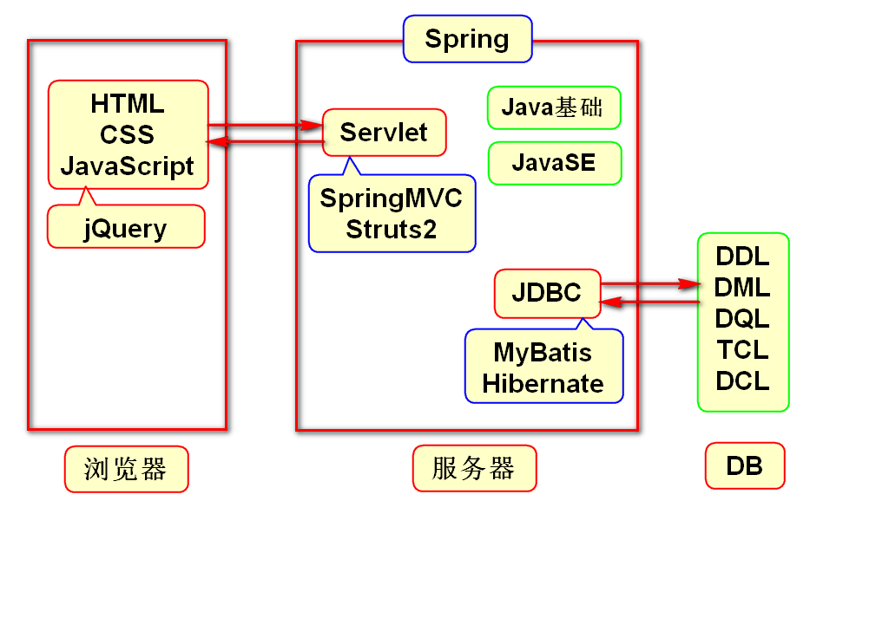
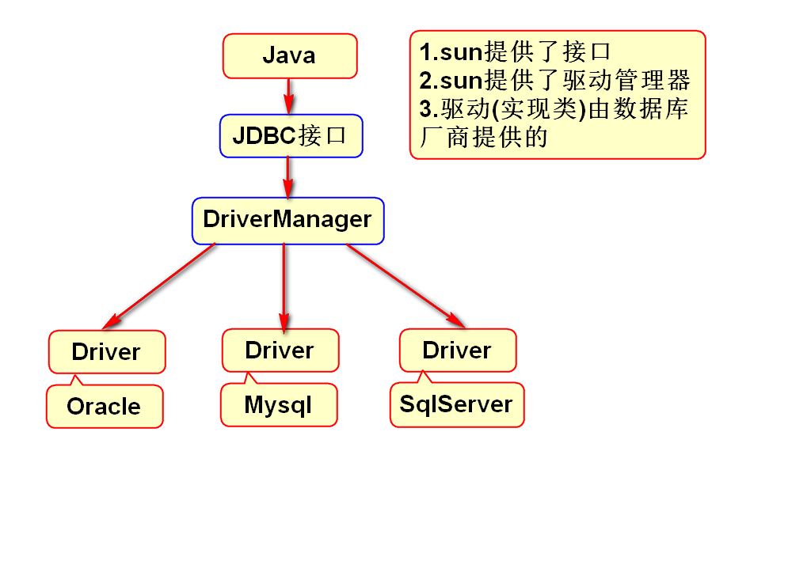
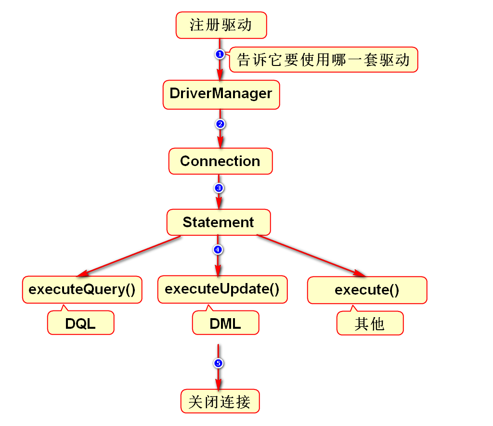
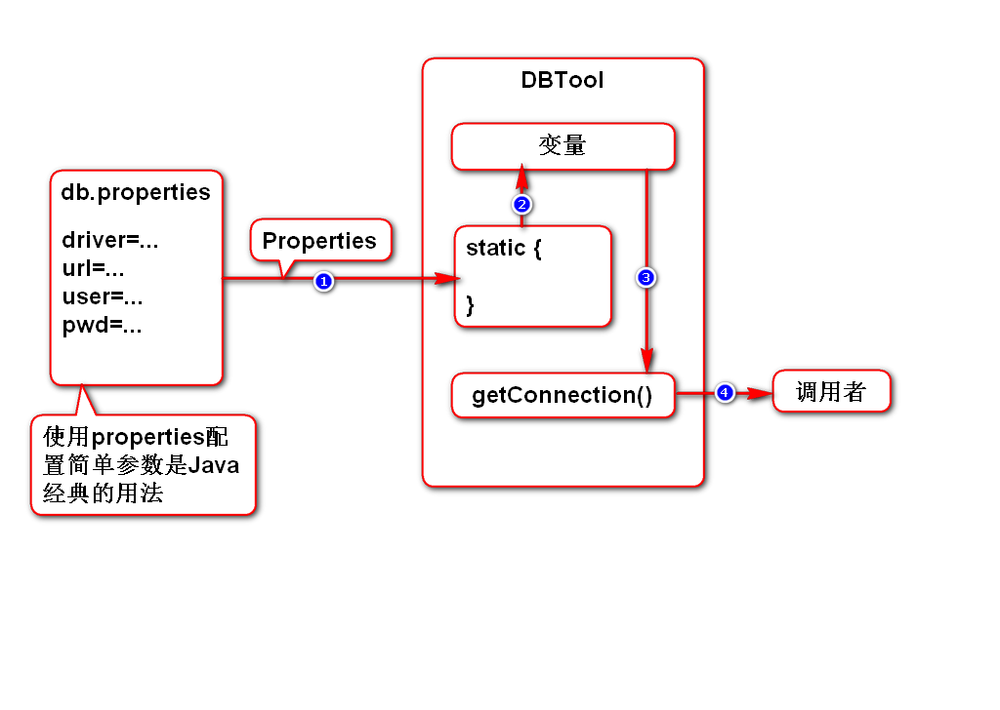

# 自我介绍
- 姓名:李洪鹤
- lihh@tedu.cn

# 一.Java体系结构

# 二.JDBC介绍
## 1.JDBC的要点

## 2.使用步骤

# 三.导包
## 1.搜索
- 打开浏览器,访问maven.tedu.cn
- 在搜索框内输入"ojdbc"

## 2.复制代码
- 在搜索结果中选择第2条
- 在下方的框内复制XML标签代码

> 其他的版本通常也能用,但可能会有些版本有问题

## 3.粘贴代码
- 打开pom.xml最后页签
- 手动输入标签dependencies
- 将复制的内容粘贴到此标签内部

# 四.DBTool封装的思路
