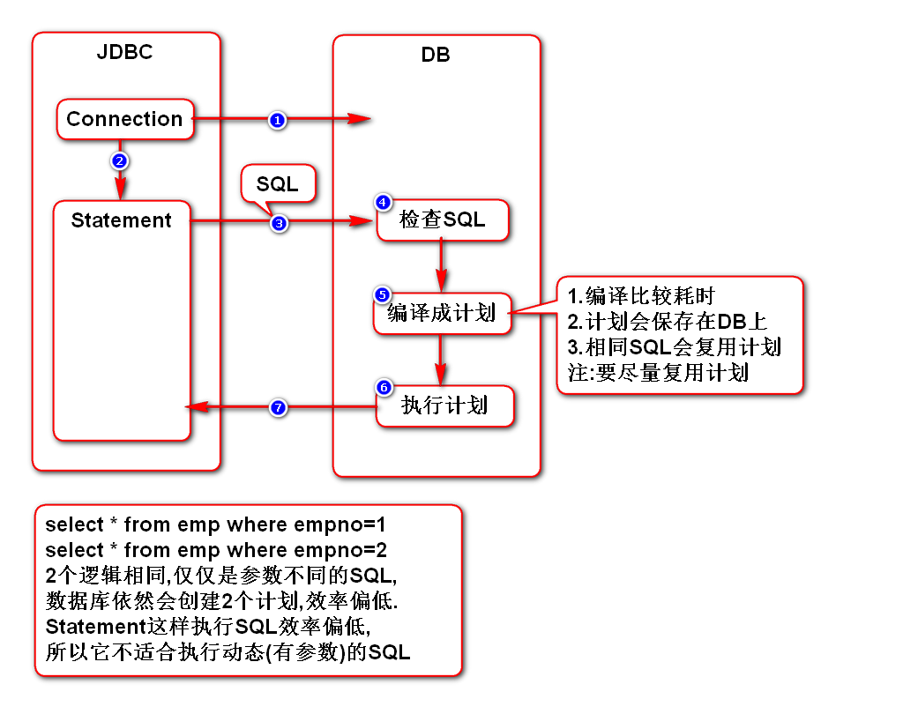
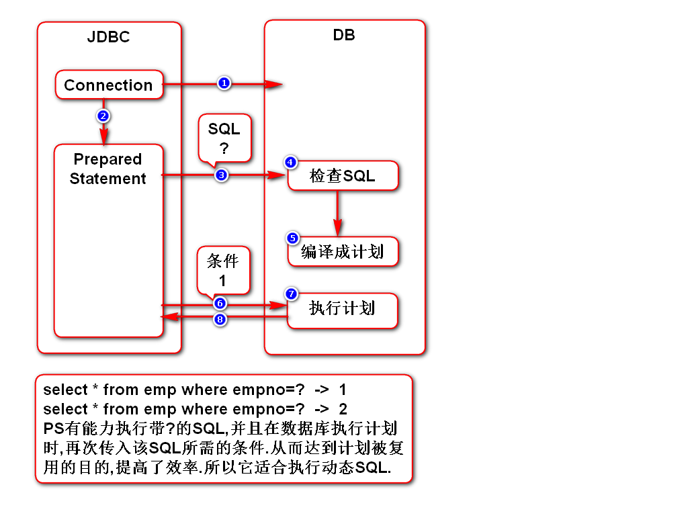
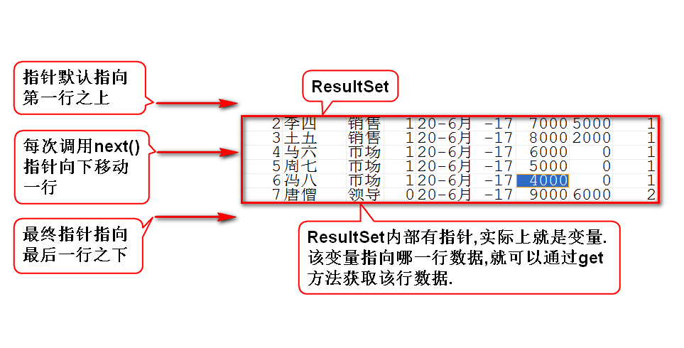

# 一.连接池(数据源)
## 1.使用DriverManager创建连接的问题
- 每次调用都创建一个新连接,没有复用连接,效率低
- 它没有控制连接的上限,并发量大的时候可能会导致数据库崩溃

## 2.连接池的作用
- 它能复用连接,提高效率
- 它能控制连接的上限,避免数据库崩溃

> 它能解决上述DriverManager的问题

## 3.常用的连接池
- DBCP
- C3P0

## 4.连接池的工作原理
1. 初始化连接池时,它会自动创建一批(配)连接,并标记为空闲态
2. 当调用它获取一个连接时,它会返回一个连接,并标记为占用态
3. 当归还连接时,连接池会将其内部数据清空,并标记为空闲态
4. 当连接池发现连接快不够用(配)时,它会再创建一批(配)连接
5. 当占用连接达到上限(配)时,连接池会让新用户等待
6. 当高峰期过后,连接池会自动关闭一批(配)连接

## 5.如何使用连接池
- sun规定了连接池接口DataSource
- DBCP提供了实现类BasicDataSource

# 二.Statement和PreparedStatement
## 1.它们的联系
- 它们都能够执行SQL
- PreparedStatement extends Statement

## 2.它们的区别(*)
- Statement适合执行静态(无参数)的SQL
- PreparedStatement适合执行动态(有参数)的SQL

## 3.Statement工作原理

## 4.PreparedStatement工作原理

## 5.使用PS执行SQL可以避免注入攻击

# 三.结果集
## 1.结果集的工作原理

## 2.ResultSetMetaData
- 元:根本、本质
- 元数据:数据的本质(对数据的概括/描述)
- 结果集元数据:对结果集进行描述的数据,包含多少列、列名、列类型等

## 3.可滚动结果集
- 简单了解,几乎不用.