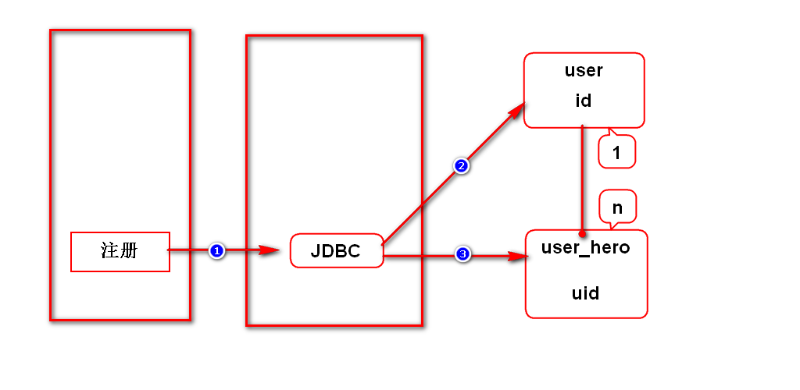
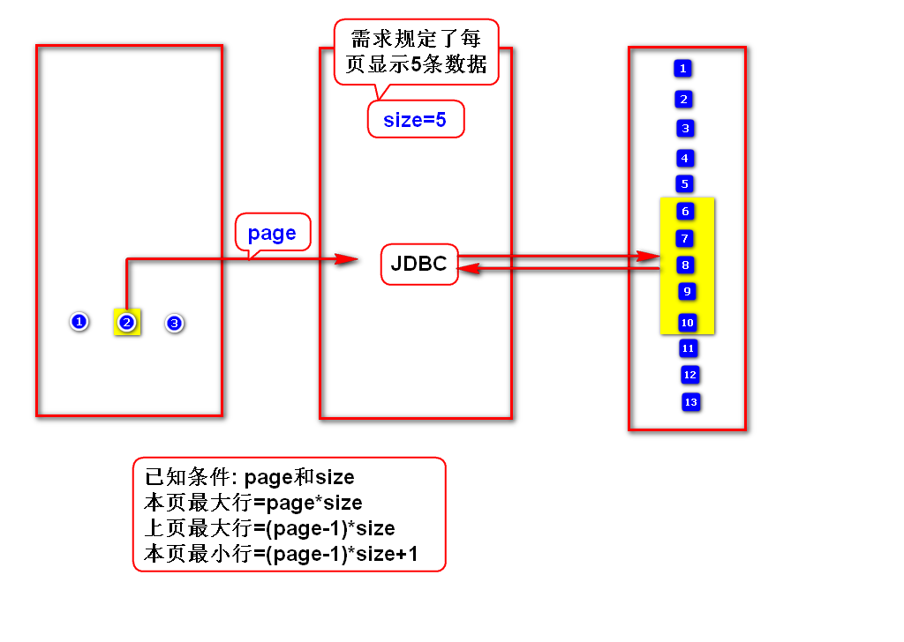
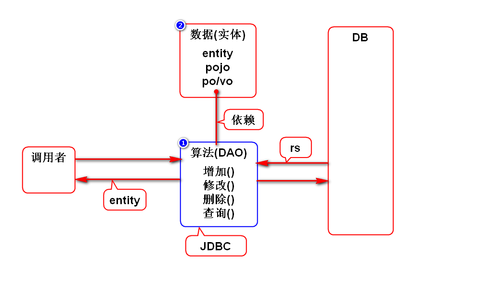

# 一.JDBC中的事务管理
## 1.自动管理
- JDBC会自动管理事务
- 每次调用executeUpdate()时,JDBC会自动commit

> 若业务中只包含一次DML操作,自动管理事务即可

## 2.手动管理
- 取消自动管理事务: conn.setAutoCommit(false);
- 手动提交: conn.commit();
- 手动回滚: conn.rollback();

> 若业务中包含多次DML操作,需要手动管理事务

## 3.什么是事务?
- 满足如下特点的数据库访问:
- 原子性:事务是一个完整的过程,要么都成功,要么都失败.
- 一致性:事务访问前后的数据要一致,即收支平衡.
- 隔离性:事务访问过程中的数据不能被别人访问.
- 持久性:事务一旦完成,就永久有效.

> 大部分数据库都支持事务,上述4点完整的构成了事务.

# 二.批量添加数据
- 通常导入功能需要用到批量添加数据
- 必须SQL相同的数据才能一起批量添加

# 三.获取自动生成的主键
## 1.使用场景
- 用户和英雄是1对多的关系,通过主外键关联
- 需先增加用户,然后再给用户增加英雄,而后者需获取英雄主键

## 2.反查ID
- insert into user values(seq.nextval,?,?)
- select * from user where username=?

## 3.单独执行序列
- select seq.nextval from dual -> id
- insert into user values(?,?,?)

## 4.让ps获取生成的ID(*)
- 详见案例

# 四.分页
## 1.假分页(内存分页)
- 第1次查询某表就查询所有数据,将数据存入内存(List)
- 第N次查询则从内存(List)中取数,而不再访问数据库了
- 第1次查询巨慢,以后查询较快,耗内存
> 只适合数据量很小的小项目

## 2.真分页(物理分页)*
- 每次查询某表都是查询一页数据(分页SQL)
- 每次查询速度都较快,不耗内存
> 适合任何项目

## 3.oracle分页SQL

	select * from (
	  select e.*,rownum r from (
	    select * from emps_lhh order by empno
	  ) e
	) where r between 11 and 20;

## 4.分页条件
- 本页最大行 = page*size
- 本页最小行 = (page-1)*size+1

# 五.封装的思想
## 1.封装的方式
- 接口和工厂后面课程会讲
- 当前阶段由于业务过于简单,无法体现出它们的作用

# 补充1:JDBC中的日期类型
- java.sql.Date 年月日
- java.sql.Time 时分秒
- java.sql.Timestamp 年月日时分秒
> 上述日期都继承于java.util.Date

# 补充2:JavaBean
- 满足如下规范的类:
- 必须有包
- 必须有无参构造器
- 必须实现序列化接口
- 通常有get和set方法