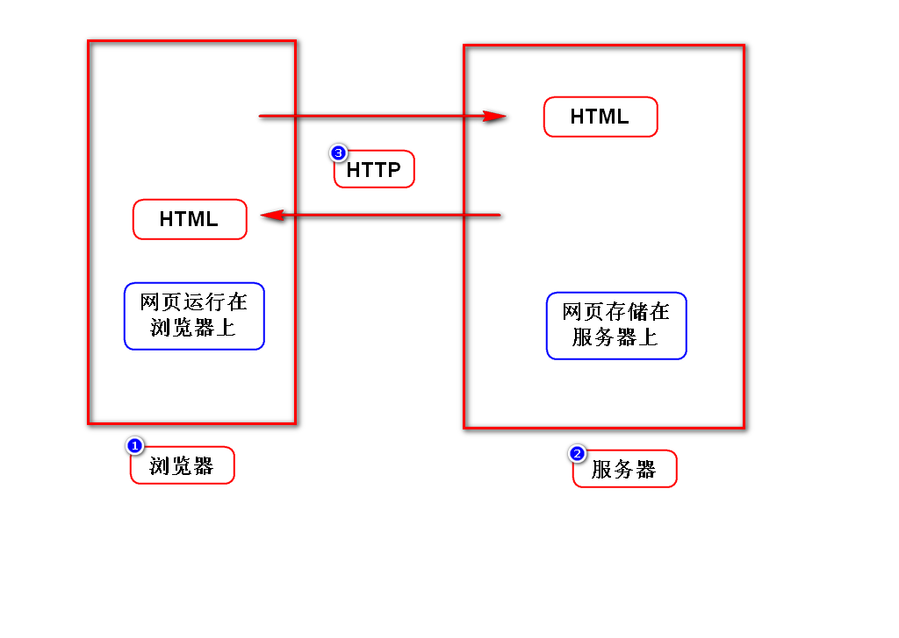
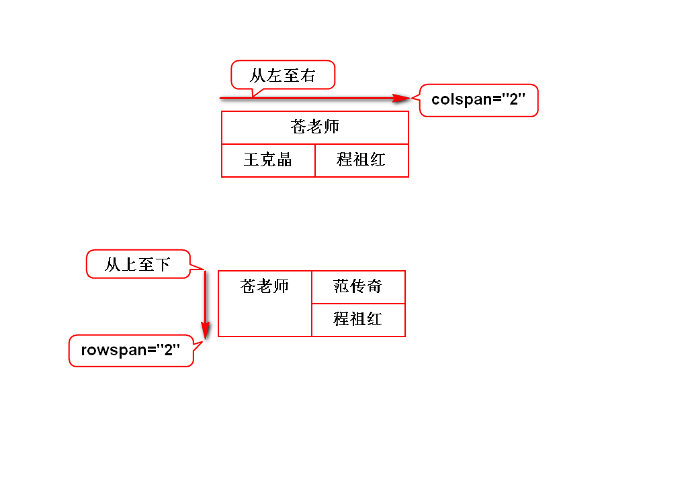
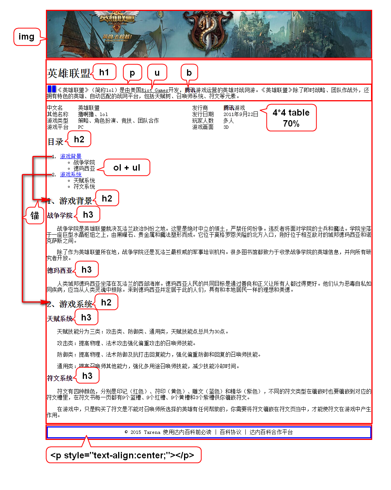

# 一.课程介绍
## 1.HTML(1.5天)
- 勾勒出网页的结构和内容

## 2.CSS(3天)
- 用来美化网页

## 3.JavaScript(4天)
- 能让网页呈现动态的内容和效果

## 4.jQuery(1.5天)
- 是一个框架,提高js编程效率

# 二.WEB概述

# 三.XML和HTML对比
## 1.XML
- 可扩展(自定义)标记语言
- 标签、属性、标签的关系都可以扩展
- 用来存储或传输数据

## 2.HTML
- 超文本标记语言
- 标签、属性、标签的关系都是固定的(W3C)
- 用来显示数据
- 某些版本的HTML是严格遵守XML规范的
> 将HTML理解为语法固定的XML

# 四.跨行跨列

# 五.英雄联盟案例
## 1.分区
- 分3个区域
- 每个区域都要设置边框、宽度、居中

		style="border:1px solid red;width:960px;margin:0 auto;"

## 2.逐个区域开发

# 补充1:创建WEB项目注意事项
## 1.JavaEE视图
- 在Eclipse右上角选择JavaEE视图

## 2.war包
- 在创建项目最后一步选择war

## 3.解决报错
- 展开项目
- 右键点击Deployment
- 点击Generate