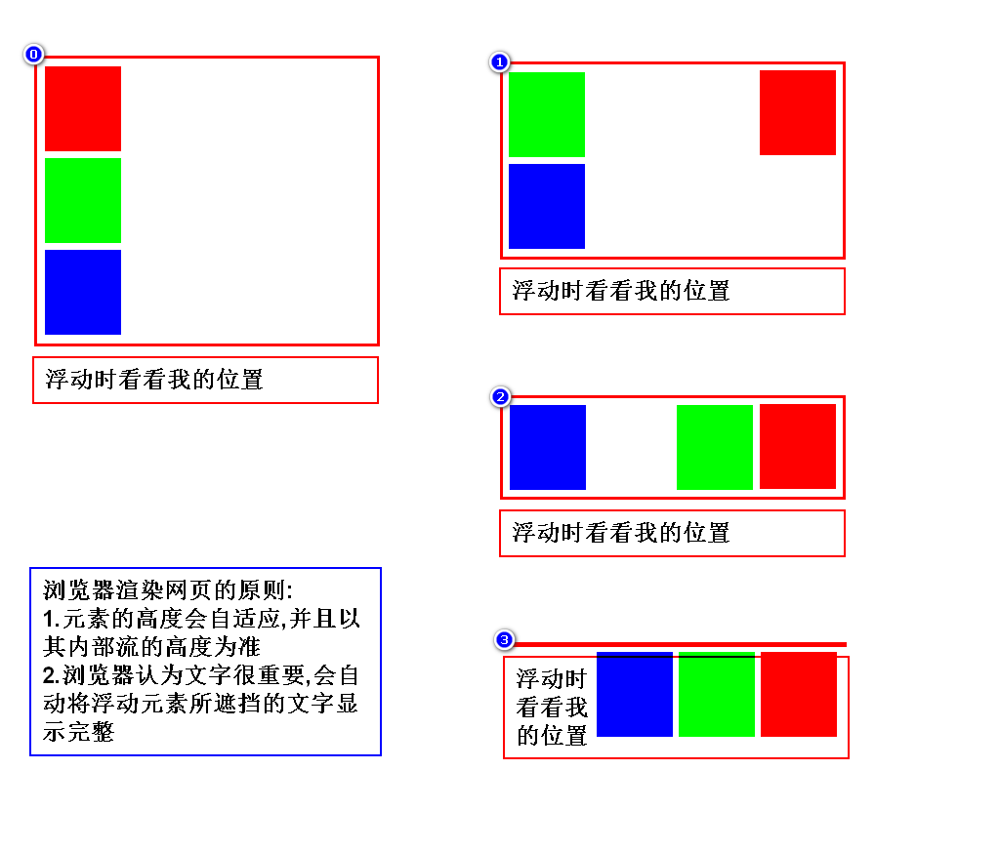
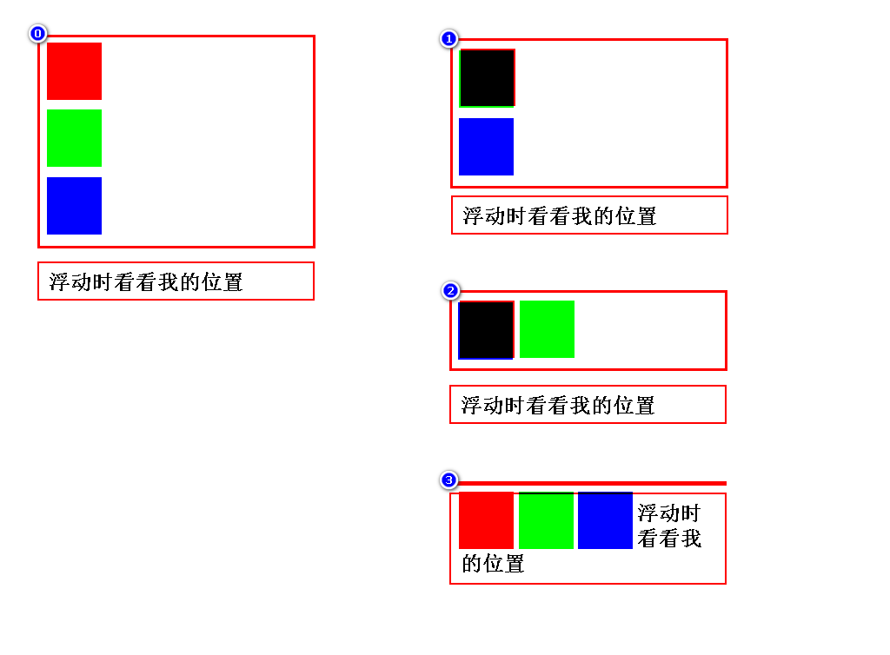
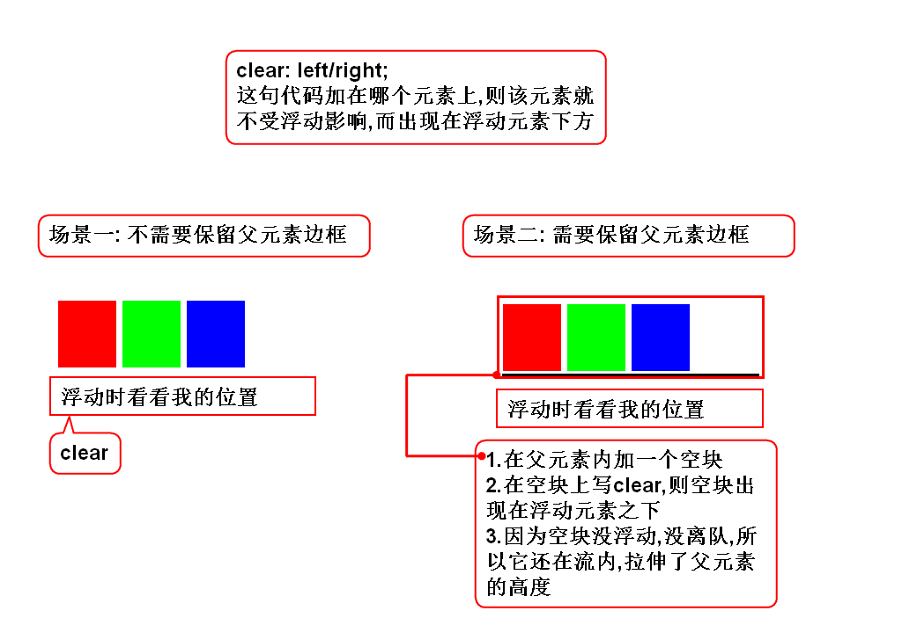
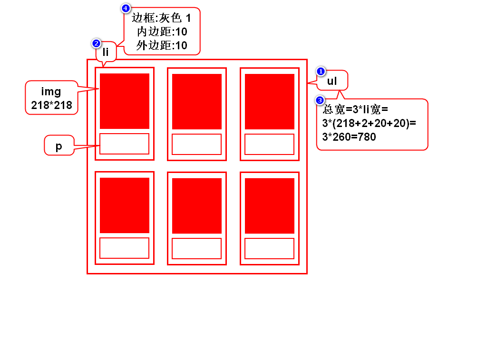
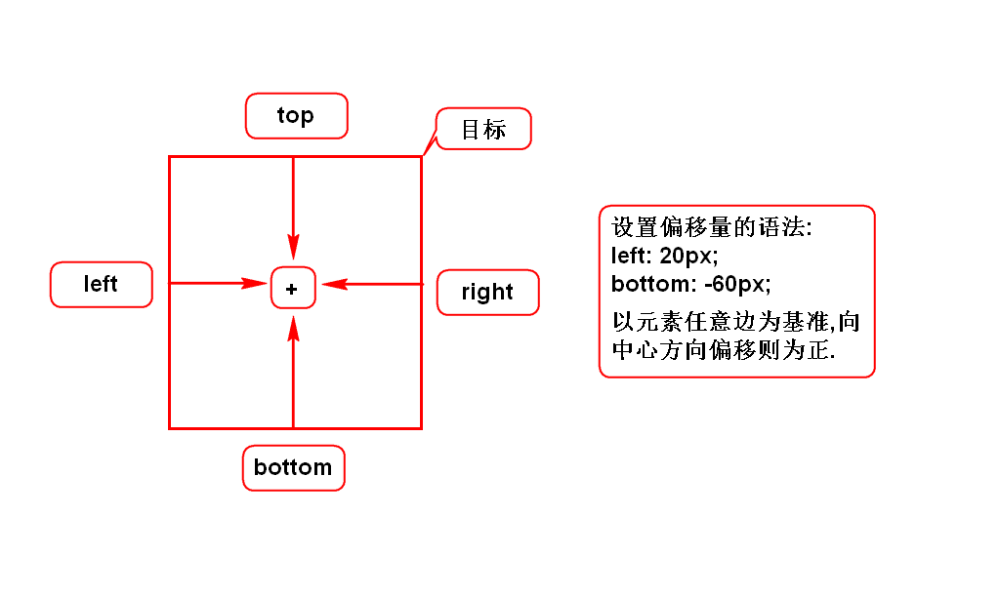
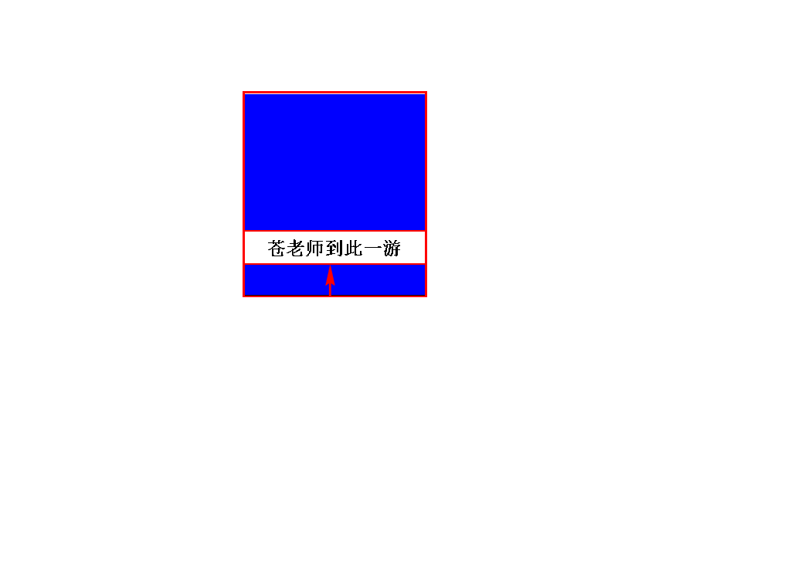
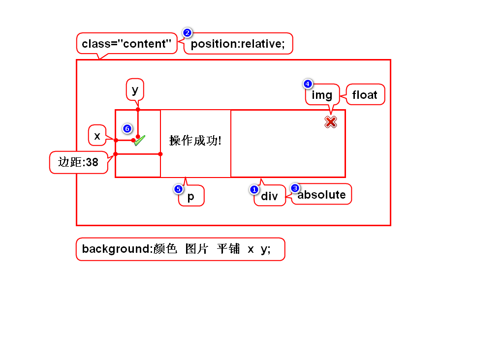

# 一.定位简介
## 1.定位的作用
- 用来解决元素的排列/摆放问题
> 使用定位可以随心所欲的摆放元素

## 2.定位的分类
### 1)默认定位
- 默认情况下,块元素垂直排列,行内元素水平排列
- 这种排列方式称之为默认定位,也叫流定位
> 流:元素有序排列而形成的队伍

### 2)特殊定位(*)
- 浮动定位:解决块元素左右排列的问题
- 相对定位:让元素以自身为目标产生微小的偏移
- 绝对定位:让元素以父辈为目标产生较大的偏移
- 固定定位:让元素以窗口为目标产生巨大的偏移
> 后三种定位是类似的

# 二.浮动定位
## 1.介绍
- 作用:可以让块左右排列
- 特征:浮动的目标离队(脱离流)
- 分类:左/右浮动
- 步骤:1)目标离队 2)后者跟进 3)目标去左/右侧

## 2.右浮动
- 可以让块按照倒序左右排列

## 3.左浮动
- 可以让块按照正序左右排列

## 4.消除浮动影响

## 5.照片墙

# 三.相对、绝对、固定定位
## 1.三者的不同点
- 偏移时所参考的目标不同

## 2.三者的相同点
- 声明偏移量的方式相同

# 3.相对定位
- 以元素自身为目标产生偏移
- 元素不离队(脱离流)
- 语法: position:relative;
> 只有相对定位不离队

# 4.绝对定位
- 以带有position属性的父辈为目标产生偏移
- 若所有父辈都有position,则以就近的父辈为目标
- 若所有父辈都没position,则以body为目标
- 元素会离队(脱离流)
- 语法: position:absolute;
> 你想以谁为目标,就在谁上面加position

# 5.固定定位
- 以浏览器的窗口为目标产生偏移
- 元素会离队(脱离流)
- 语法: position:fixed;
> 被固定的元素会永远挂在窗口上,保持不动

# 四.定位的使用建议
## 建议按照如下顺序选择定位:
1. 固定:看是否要求元素挂在窗口上保持不动.
2. 相对:看偏移量是不是很小,看位置是否释放.
3. 浮动:看是否想将块元素左右排列.
4. 绝对:超过15秒没想出来,基本就用绝对定位.

# 五.管理员列表-5

# 六.元素的显示方式
## 1.元素有哪些显示方式?
### 1)块
- 有宽高,垂直排列
- h,p,ol,ul,div,table,form

### 2)行内
- 无宽高,水平排列
- span,i,em,b,strong,u,del,a,label

### 3)行内块
- 有宽高,水平排列
- img,input,select,textarea

## 2.如何修改元素的显示方式?
- 块: display:block;
- 行内: display:inline;
- 行内块: display:inline-block;
- 隐藏: display:none;