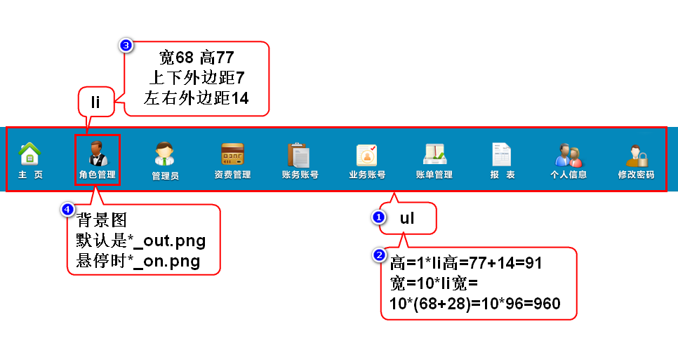

# 一.管理员列表-6

# 二.计算平方案例

# 三.js调试技巧
## 1.看报错信息
- 在浏览器的控制台看报错信息
> 多看看,翻译一下,最起码混个脸熟

## 2.打桩
- 为了跟踪程序执行的过程
- 为了看变量的值是否正确

## 3.排除法
- 删除一部分代码,看程序还是否报错
- 建议删除一半留一半(二分法)
> 此方法用于找到问题所在

# 四.猜数字

# 五.计算阶乘
- 0的阶乘是1
- 整数n的阶乘是1x2x...xn
