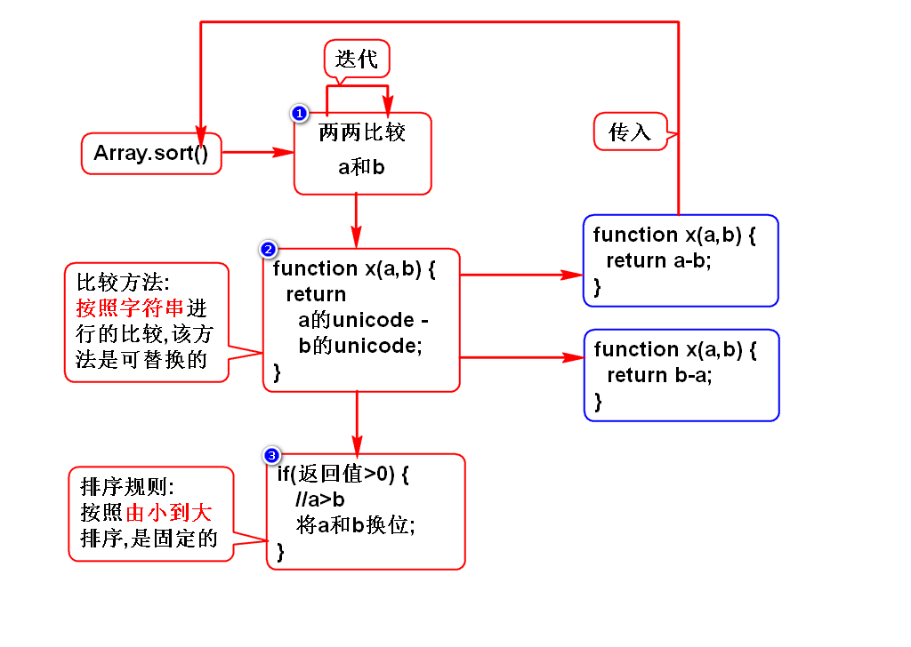
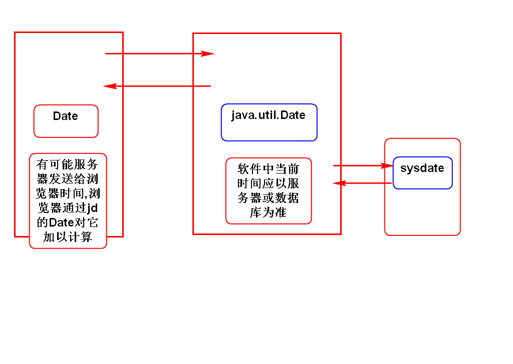
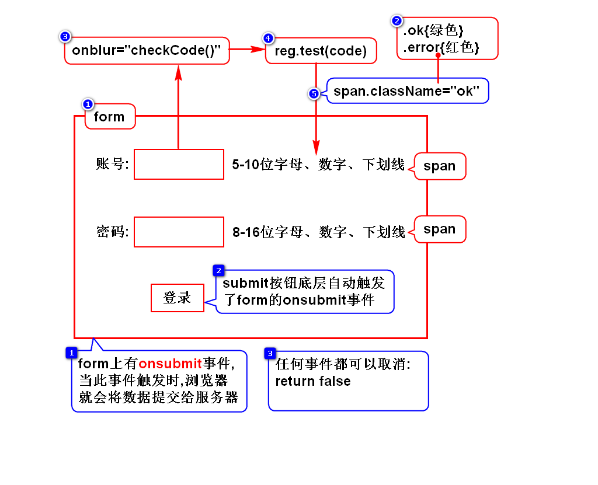
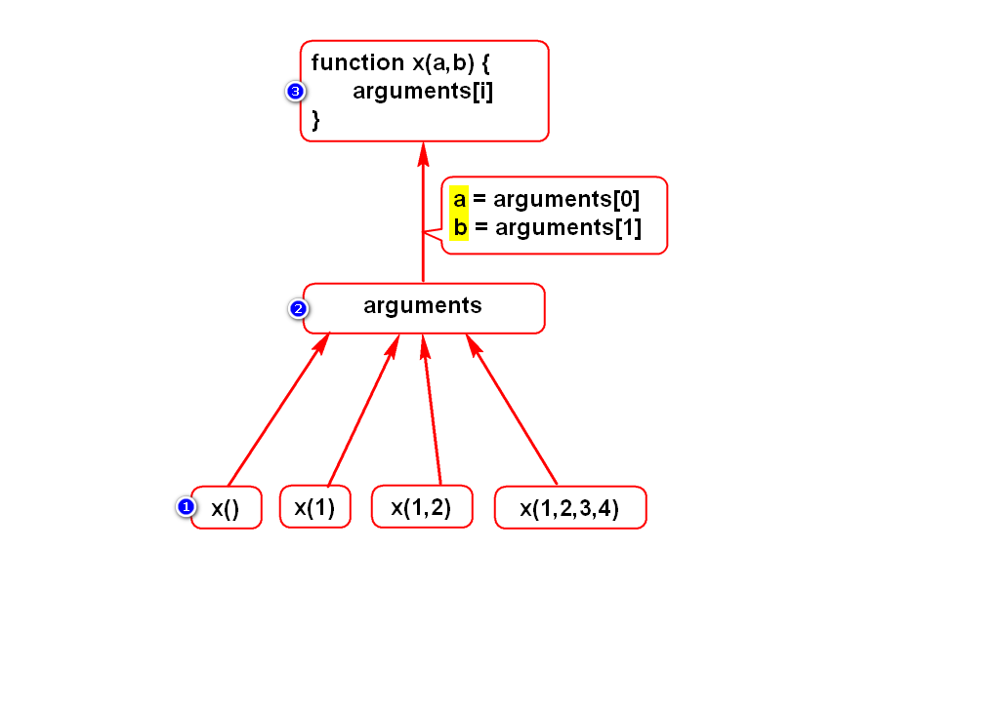
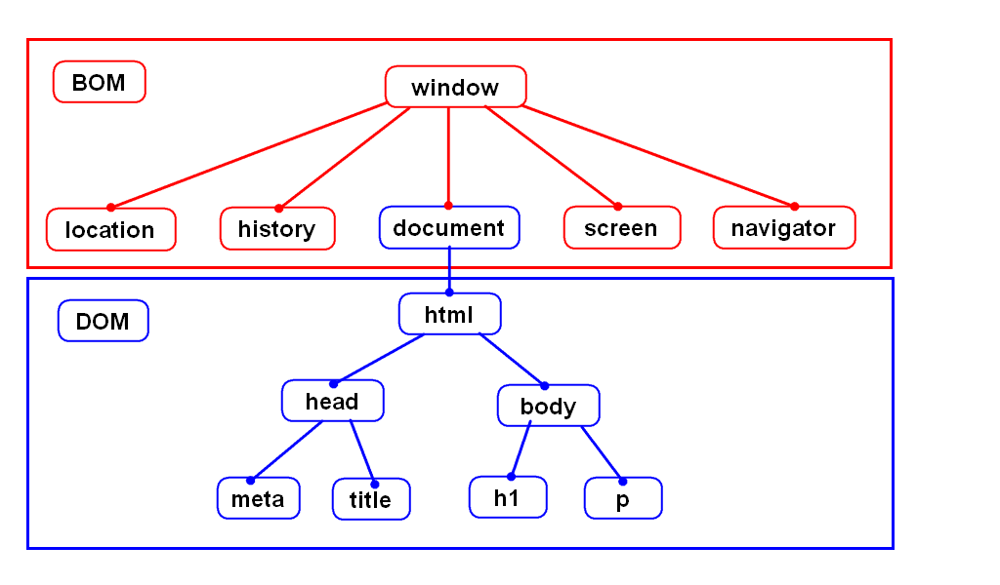

# 一.内置对象
## 1.String对象
- 和Java中的String类似
- 看看手册

## 2.Number对象(*)
- toFixed(n)

## 3.Array对象(*)
- 如何创建对象
- 数组倒转方法
- 数组排序方法(*)

## 4.Math对象
- 和java中的Math类似
- 看看手册

## 5.Date对象
- 如何创建日期
- 如何转换为本地格式
- 如何读写时间分量

## 6.正则对象
### 1)正则对象的方法
- test方法 (*)
- exec方法 (了解)

### 2)String对象支持正则的方法
- replace()
- match()
- search()

### 3)登录案例

## 7.Function对象
- arguments (*)
- eval (*)

# 二.外部对象介绍
- 外部对象的本质就是浏览器的API.
- 外部对象分为BOM和DOM,二者是包含关系.
