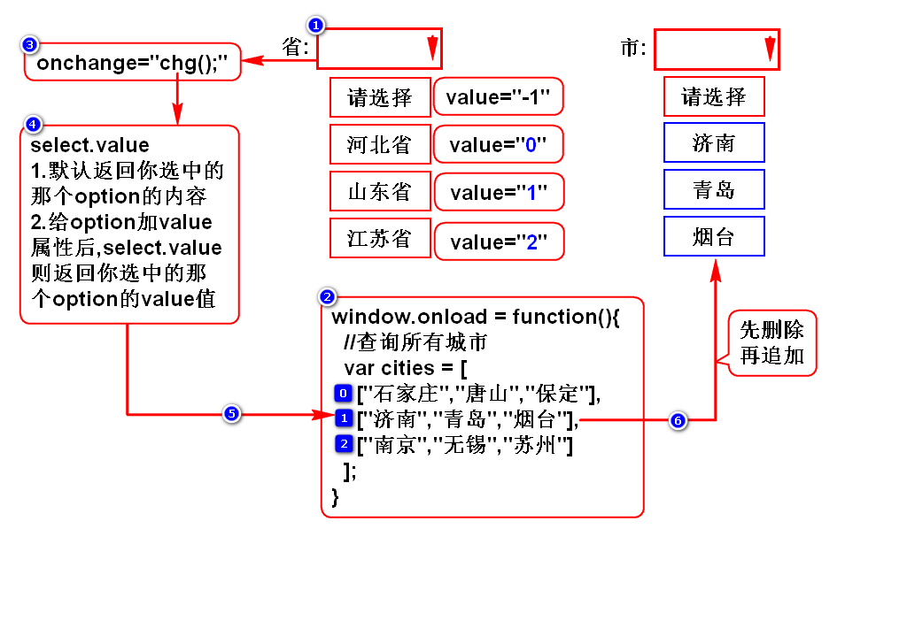
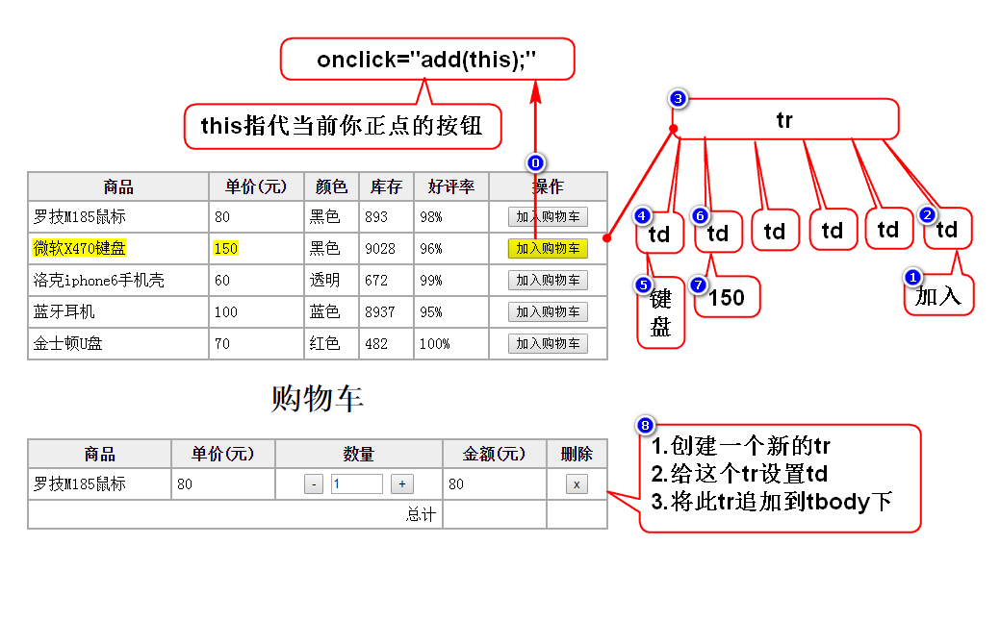
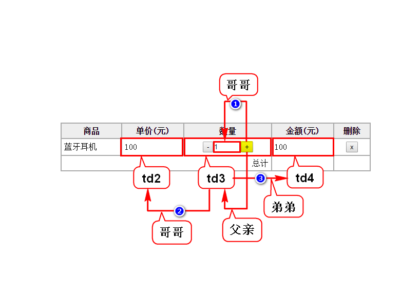

# 一.省市联动

# 二.加入购物车

# 三.加法

# 四.自定义对象
## 1.直接量(JSON对象)
- var s = {"name":"zs","age":23}
- {}代表一个对象,内含多组键值对
- 其中key一般是字符串,value是任意类型的数据

## 2.构造器(首字母大写的函数)
### 2.1内置构造器
- 特殊:String,Array,Date,RegExp
- 通用:Object

### 2.2自定义构造器