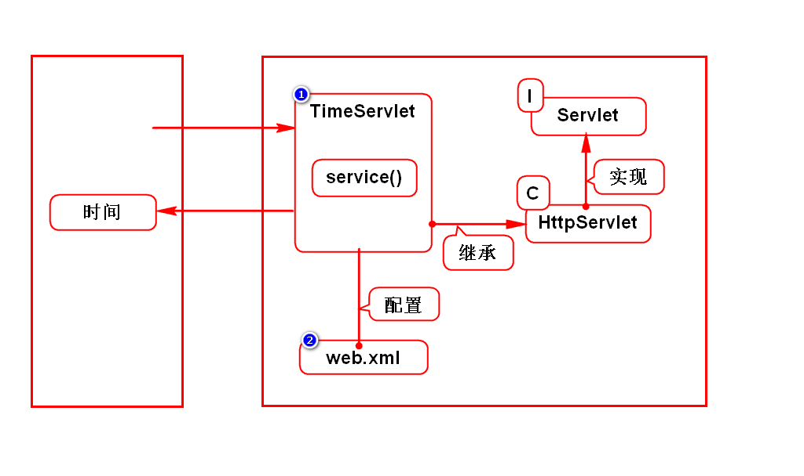
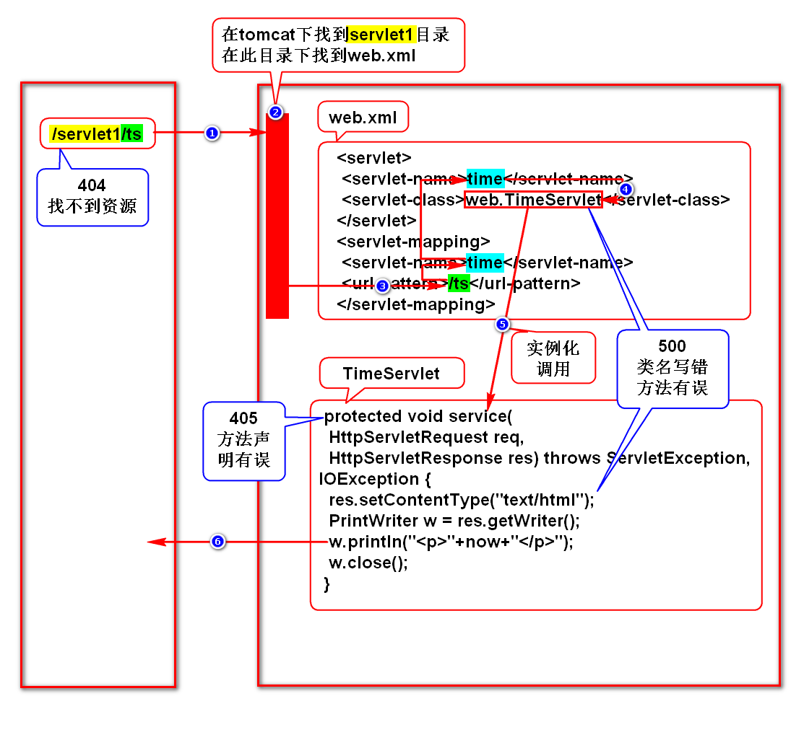

# 一.WEB项目的演变
## 1.演变的规律
1. 由单机向网络演变
2. 由CS向BS演变

## 2.CS
- Client Server
- 即客户端和服务器软件
- 客户端需要单独的开发及安装

## 3.BS
- Browser Server
- 即浏览器和服务器软件
- 用浏览器充当客户端,无需单独开发及安装

# 二.Servlet简介
## 1.服务器如何给浏览器返回一个网页?
### 1)静态网页
- w3school手册,百科,新闻
- 每个人看到的结果都一样
- 服务器直接保存HTML,并返回HTML即可

### 2)动态网页
- 淘宝,微博
- 每个人看到的结果有差异
- 服务器保存对象,由此对象动态拼HTML
> 在Java语言中,这个能拼网页的对象就是Servlet

## 2.Servlet的特征(*)
- Servlet保存在服务器端
- 该对象有相关的规范
- 它能够动态的拼资源(网页、图片等)
> 术语:处理HTTP协议

## 3.什么是Servlet
- 是sun推出的用于在服务器端处理HTTP协议的组件
> 组件:满足规范的对象

# 三.服务器
## 1.名词解析
- Java服务器
- WEB服务器
- Java WEB服务器
- Servlet容器

## 2.本质
- 是一个软件

## 3.举例
- Tomcat(Apache)
- JBOSS
- WebLogic
- WebSphere

# 四.Tomcat使用方式
## 1.单独使用Tomcat(上线时)
### 1)配置环境变量
- 配置好JAVA_HOME

### 2)下载及安装
- 可以在Apache官网下载,也可以在doc.tedu.cn/tomcat下载.
- 它是绿色版软件,解压缩即可用.
> 学生机上已经安装好了(/home/soft01/tts9).

### 3)启动tomcat
#### Linux
- 打开/tomcat/bin,在终端输入chmod +x *sh
- 打开/tomcat/bin,在终端输入./startup.sh

#### windows
- 打开/tomcat/bin,双击startup.bat

### 4)访问tomcat
- 打开浏览器,输入:
- http://localhost:8080
- 回车后看到一只喵则代表成功

### 5)关闭tomcat
#### Linux
- 打开/tomcat/bin,在终端输入./shutdown.sh

#### windows
- 打开/tomcat/bin,双击shutdown.bat

## 2.使用Eclipse管理Tomcat(开发时)
- 参考doc.tedu.cn/tomcat/index.html
- 重新配置的前提:删除tomcat并删除Servers项目

# 五.Servlet开发步骤
## 1.创建WEB项目
- WEB项目需具备标准的目录结构
- /WEB-INF/web.xml

## 2.导包
### maven搜索
- 在maven服务器上搜索javaee

### 引用tomcat内置jar包
- 右键项目->点击properties->targeted runtimes->勾选tomcat->apply

## 3.开发Servlet
- 写一个类,继承于HttpServlet
- 重写service()

## 4.配置Servlet
- 声明类,取别名
- 给此类声明网名(网络访问路径)

## 5.部署项目
- 打开Servers->右键tomcat->Add and Remove->将项目移动到右侧
- 启动tomcat,代码被部署到了/tomcat/wtpwebapps下
> 部署:就是拷贝的意思

## 6.访问Servlet
- 打开浏览器,输入
- http://localhost:8080/项目名/网名

## 7.重新部署
- 打开Servers->右键tomcat->publish

## 8.案例

## 9.程序执行过程

# 六.HTTP协议
## 1.什么是HTTP协议
- 就是一个规范/标准
- 主要规定了浏览器和服务器如何通信以及通信时的数据格式
> 详见RFC2616(HTTP1.1)

## 2.如何通信
- 建立连接
- 发送请求
- 接收响应
- 关闭连接
> 每次访问都建立新连接,会尽量降低服务器的压力

## 3.数据格式
### 1)请求数据包
- 请求行:请求的基本信息
- 消息头:对请求数据的描述
- 实体内容:请求的具体业务数据

### 2)响应数据包
- 状态行:响应的基本信息
- 消息头:对响应数据的描述
- 实体内容:响应的具体内容

## 4.不需要我们做的事情
- 浏览器和服务器通信过程已经由它们实现了
- 请求行和消息头中的大部分数据由浏览器自动填写
- 状态行和消息头中的大部分数据由服务器自动填写

## 5.需要我们做的事情
- 提供请求的实体内容(request)
- 提供相应的实体内容(response)
> 只需要学会使用request和response即可