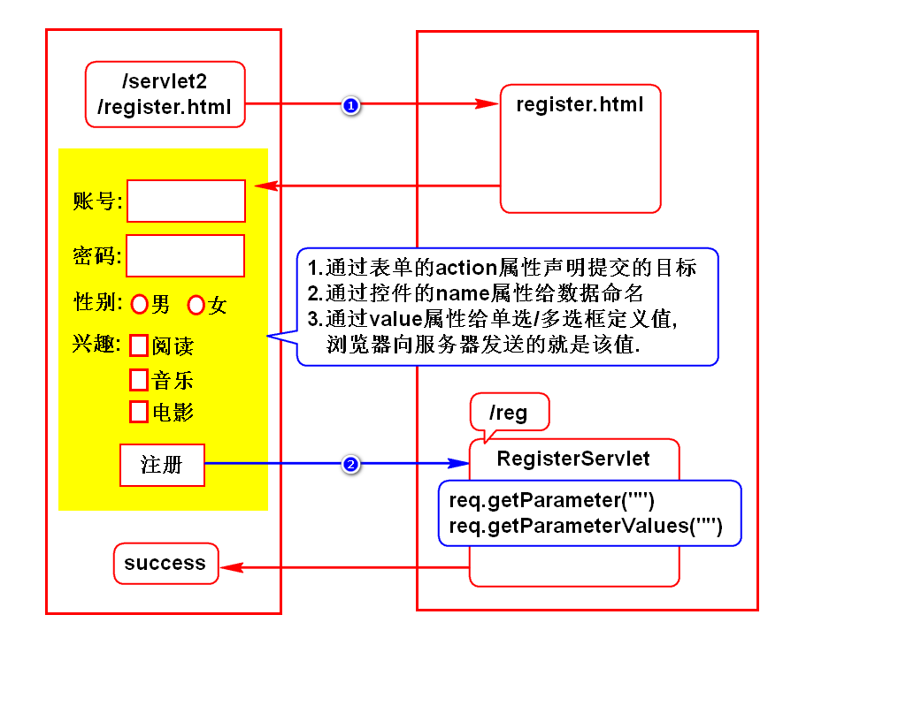
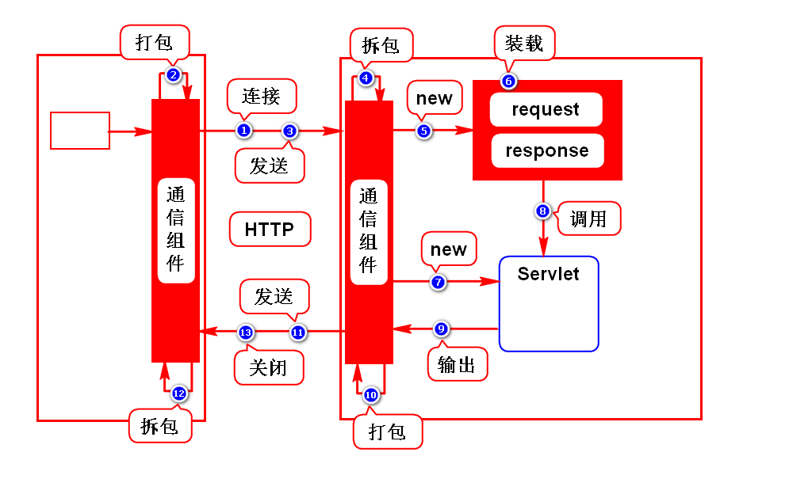
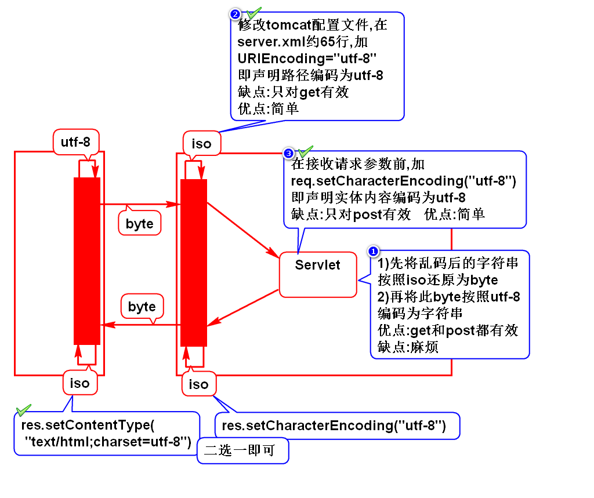
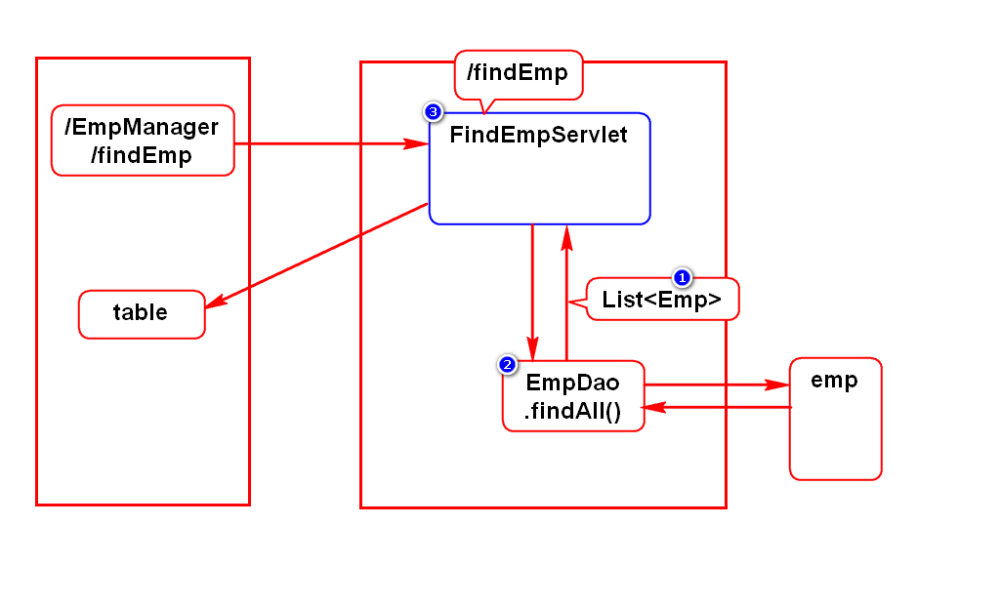
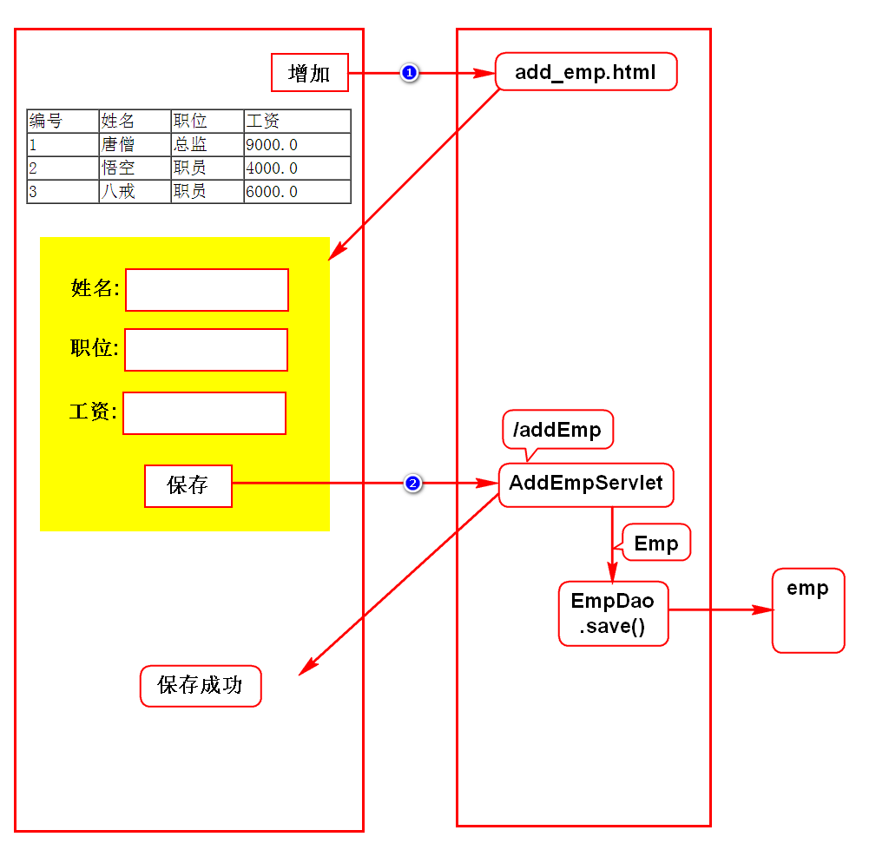

# 一.注册案例

# 二.Servlet原理

# 三.请求方式
## 1.什么是请求方式
- 就是浏览器向服务器发送业务数据的方式

## 2.常用的请求方式
- get和post

## 3.get和post的区别(面试题)
### get
- 采用路径携带参数
- 发送过程中参数可见,隐私性差
- 路径大小受限,只能传少量参数
> 默认所有请求都是get请求

### post
- 采用实体内容传参
- 发送过程中参数不可见,隐私性好
- 实体内容专门用于传参,所以大小不受限
> 在表单上加method="post"

## 4.使用建议
- 有保密数据/较多数据时用post
> 查询时用get,保存时用post

# 四.乱码解决方案

# 五.查询员工案例

# 六.增加员工案例
