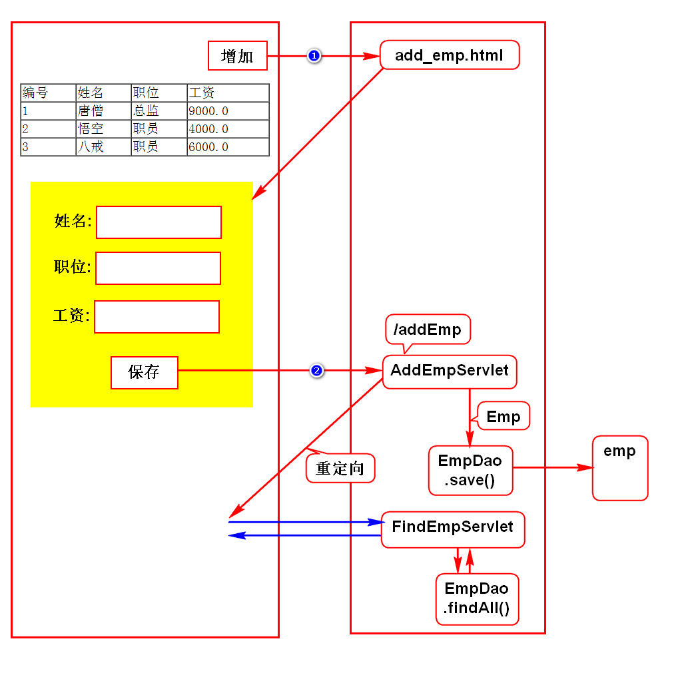
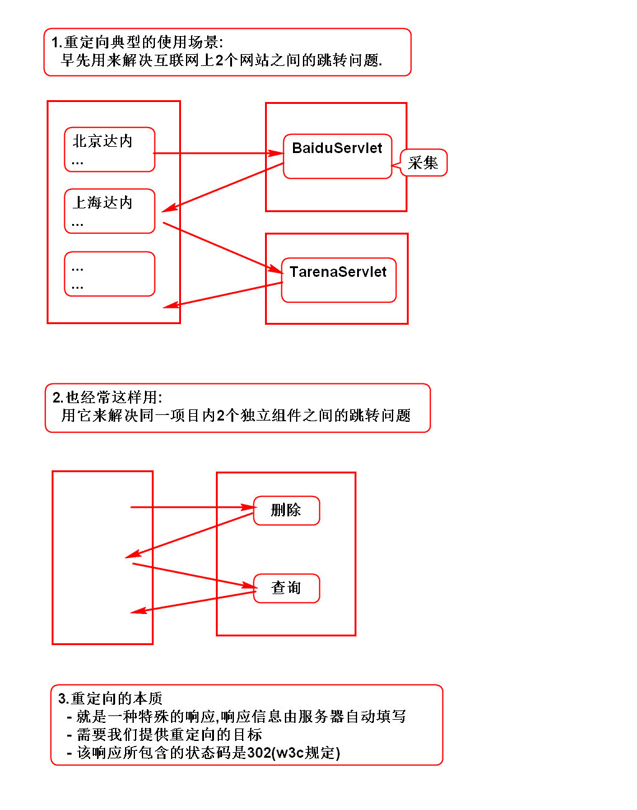
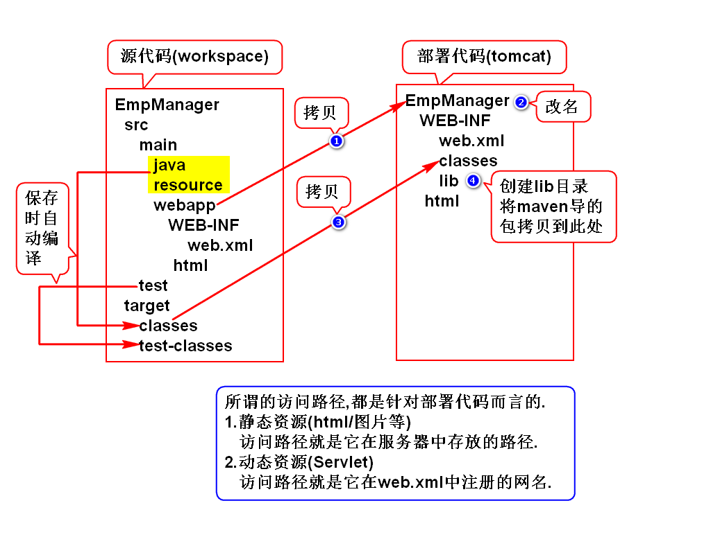
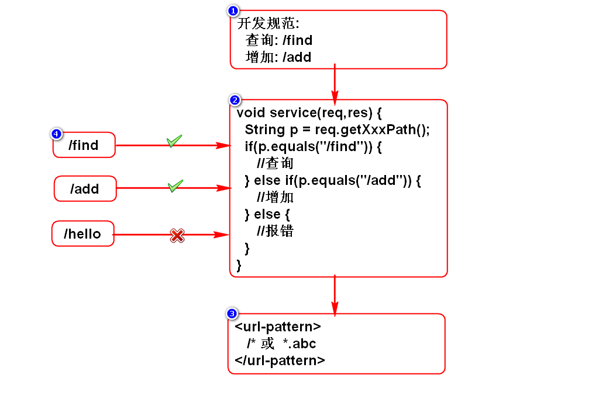
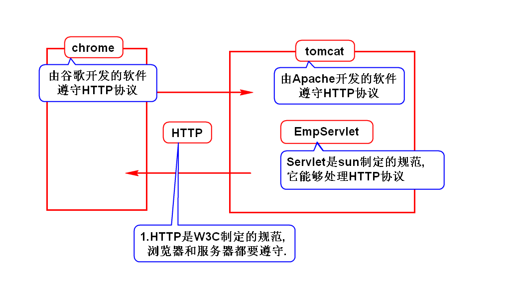
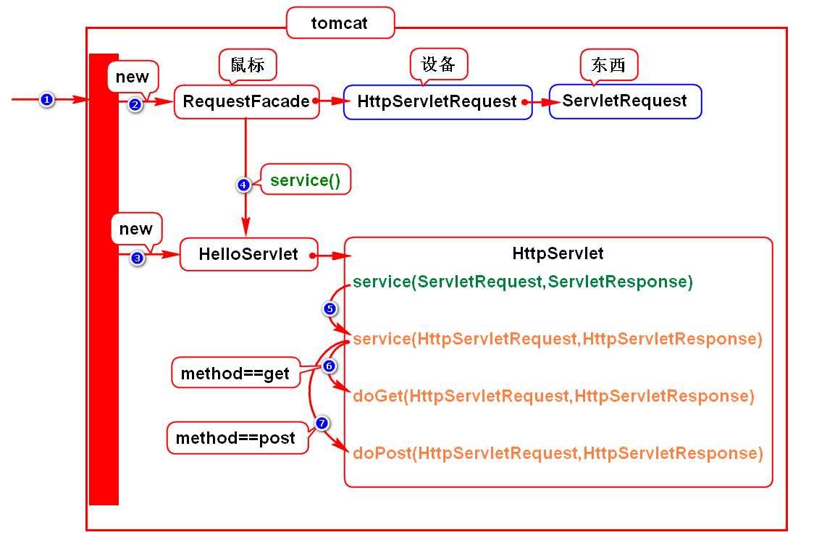
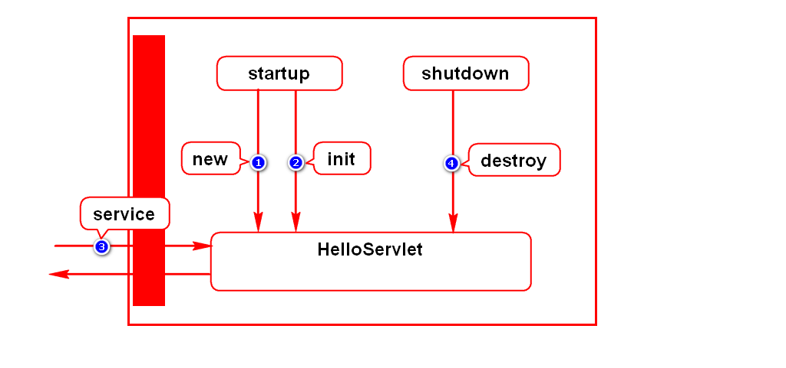
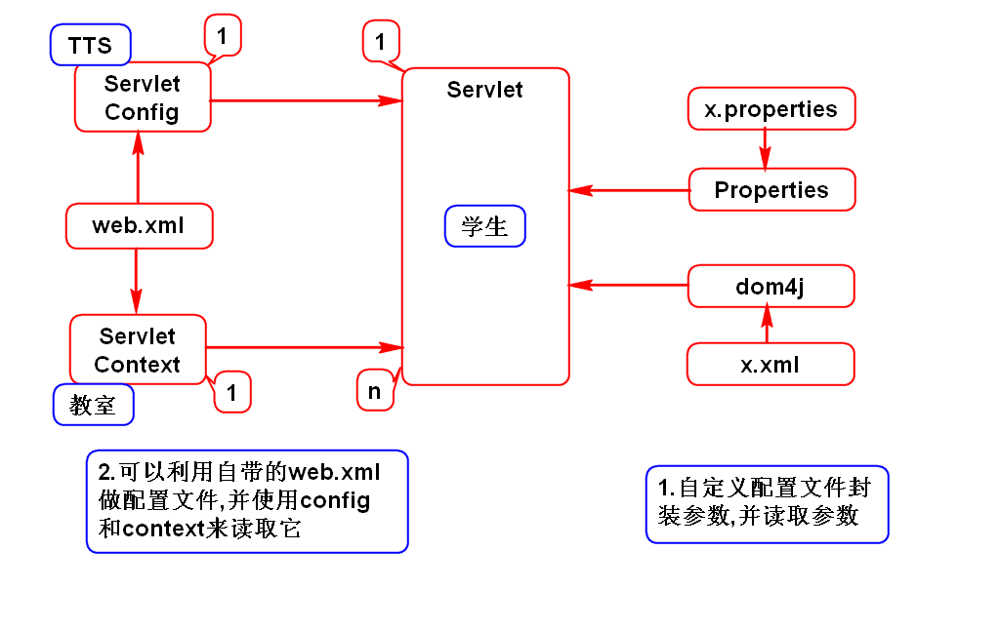

# 一.完善增加功能

# 二.重定向

# 三.访问路径
## 1.部署过程

## 2.如何获得访问路径
- 项目路径:getContextPath()
- Servlet访问路径:getServletPath()
- URI:getRequestURI()
- URL:getRequestURL()

## 3.URI和URL的区别
### 1)狭义的理解(Java项目)
- URI:绝对路径
- URL:完整路径
> URL包含了URI

### 2)广义的理解(WEB项目)*
- URI:资源的名称
- URL:资源的真名
> URI包含了URL

## 4.Servlet访问路径的配置方式
### 1)精确匹配(/hello)
- 只有/hello这个路径可以访问HelloServlet
- HelloServlet只能处理一个请求

### 2)通配符匹配(/*)
- 任何路径都可以访问HelloServlet
- HelloServlet能处理一切请求

### 3)后缀匹配(*.abc)
- 以abc为后缀的请求才能访问HelloServlet
- HelloServlet能处理多个请求

## 5.如何使用一个Servlet处理多个请求

# 四.扩展内容
## 1.HTTP协议与Servlet规范

## 2.HttpServlet
- doXXX()默认直接抛异常
- 重写service()时,要去掉super.service()
- 这样设计的目的,是为了让开发者有诸多选择

## 3.Servlet生命周期
- 默认情况下,首次访问Servlet时,tomcat实例化它.
- 可以修改为启动tomcat时就直接实例化它.
- 第1、2、4步只执行一次,所以Servlet只有一个实例,即单例.

## 4.ServletConfig和ServletContext的作用和区别
- 作用:它们都可以读取web.xml中的参数并给Servlet使用.
- config和Servlet是1对1关系,私有数据使用它来读取.
- context和Servlet是1对多关系,共享数据使用它来读取.
> 它们和Servlet的对应关系由tomcat来保障.

