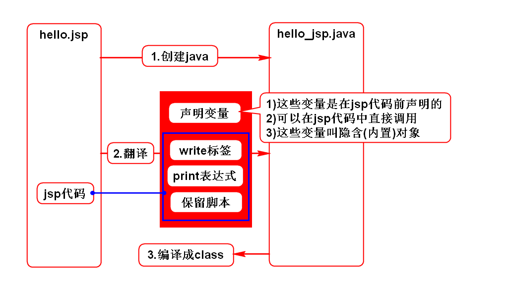

# 一.config和context的应用
## 1.config应用场景
- 假设要开发一个页游,要限制最大在线人数.
- 即:在登录功能LoginServlet中加以判断.
- 其中最大在线人数maxOnline要求可配置.
> 该参数只有LoginServlet自己用,所以用config读取即可.

## 2.context应用场景
- 软件内往往包含很多查询功能,一般都支持分页.
- 每页显示的行数(size)通常是要求可配的.
> 由于该参数是在多个功能间共用,所以用context读取.

## 3.context特殊用法
- 它不但可以读取常量,还可以读写变量,这些变量也是被共用的.
- 假设要开发一个统计网站流量的功能.
- 流量是变量,而且访问任何功能都要累加此变量,是要共用的.
- 适合采用context来读写.

# 二.Servlet线程安全问题
- 解决方案:加锁

# 三.JSP
## 1.jsp的作用
- 它的作用与Servlet一样
- 它的书写方式要比Servlet简化

## 2.jsp的语法
- jsp表达式
- jsp脚本
- jsp声明

## 3.指令
- page
- include

## 4.jsp原理
- jsp的本质就是Servlet

## 5.翻译的过程

## 6.翻译的结果

# 四.jsp隐含对象(面试题)
## 1.request(*)
- HttpServletRequest

## 2.response
- HttpServletResponse

## 3.out
- JSPWriter

## 4.config
- ServletConfig

## 5.application
- ServletContext

## 6.exception
- Throwable

## 7.session(*)
- HttpSession

## 8.page
- Object
- 值为this,指代翻译所得的Servlet对象

## 9.pageContext(*)
- PageContext
- 是一个管理者,可以管理其他8个对象

## 如何使用隐含对象?
- 在jsp上直接引用
- <%String user = request.getParameter("user");%>
- <%=request.getParameter("user")%>
