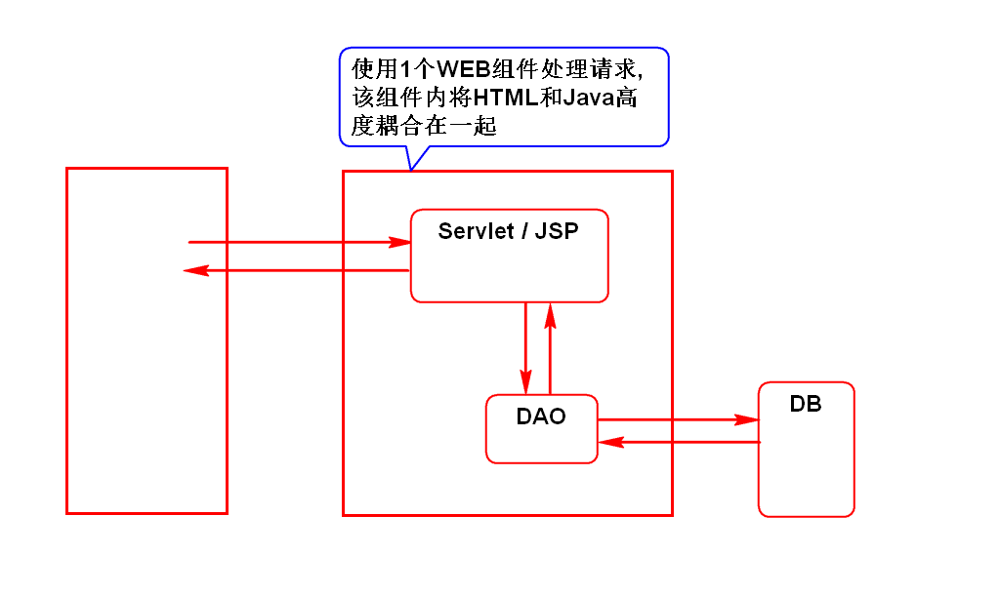
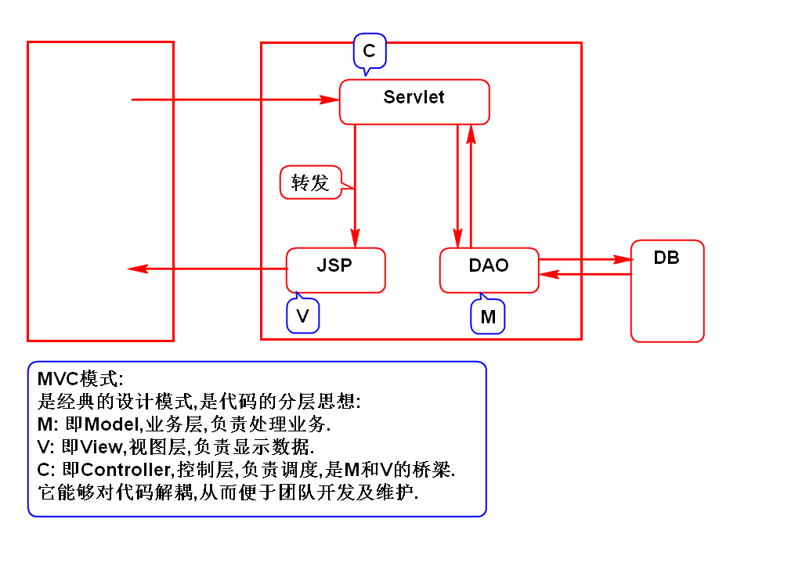
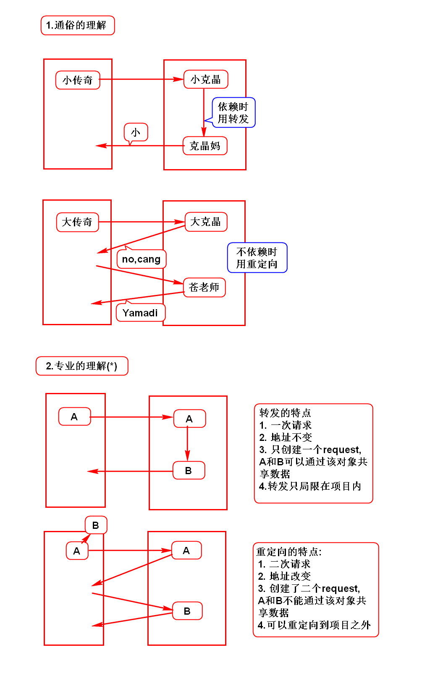
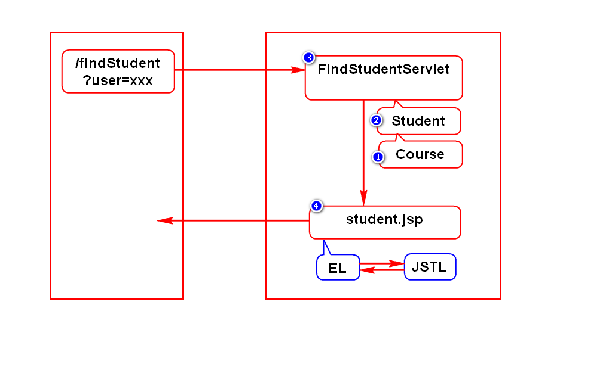
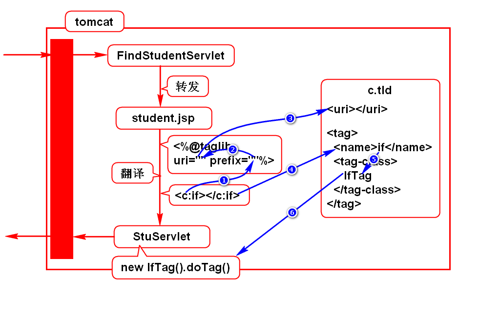

# 一.开发模式
## 1.Model 1

## 2.Model 2 (面试题)

# 二.转发和重定向
## 1.它们的相同点
- 它们都用来解决WEB组件之间的跳转问题.
> WEB组件:Java语言处理浏览器请求的组件(Servlet/JSP)

## 2.它们的区别(面试题)

## 3.使用建议
- 通常查询时用转发
- 通常增、删、改后重定向到查询

# 三.EL和JSTL
## 1.演示案例

## 2.JSTL原理
- JSTL本质上就是Java
- 在服务器翻译jsp时,会将JSTL翻译成Servlet中的一句Java代码
- 该代码通过new IfTag().doTag()得到

