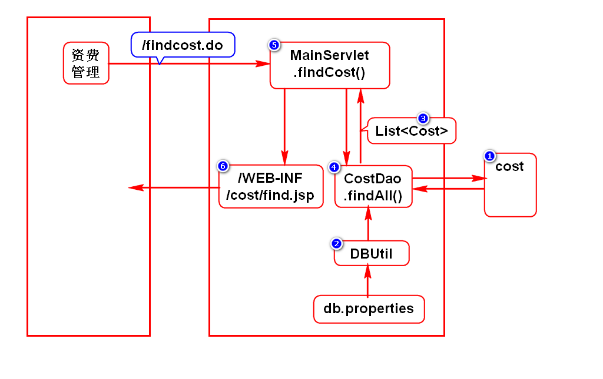
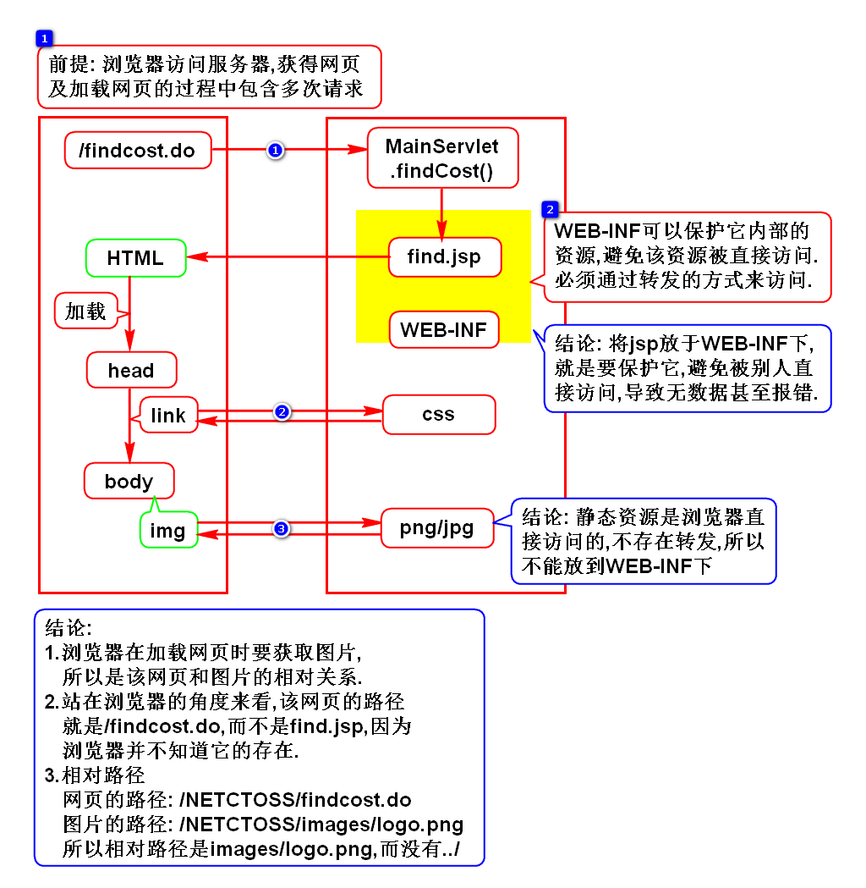
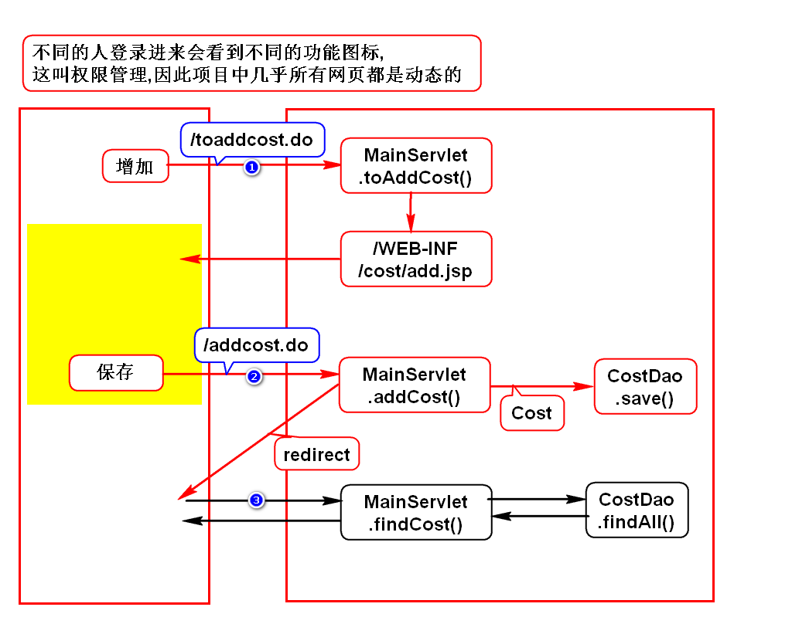

# 一.项目介绍
## 1.名词解释
- NetCTOSS
- C:China
- T:Telecom 电信
- O:Operation 运营
- S:Support 支持
- S:System 系统
- 中国电信运营支持系统-网络版

## 2.开发的思路
### 1)需求
- 和需求人员探讨、明确需求

### 2)设计(*)
- 分析当前功能包含几个请求
- 再分析每个请求的执行过程
- 采用图形、文字描述此过程
> 根据操作可以推导出请求的个数

### 3)开发
- 按照请求执行过程倒序开发每个组件

### 4)测试
- 详细的测试每种情况

## 3.导包
- JavaEE:依赖tomcat自带的包
- JSTL:使用maven搜jstl,选择1.2
- jdbc:使用maven搜ojdbc,选择10.2.0.4.0
- dbcp:使用maven搜commons-dbcp,选择1.4

# 二.资费查询
## 1.开发流程

## 2.一些问题
### 1)如何格式化jsp中的日期
- 采用fmt.tld中的formatDate标签

### 2)3个问题
- 为什么不写../
- 为什么jsp要放在WEB-INF下
- 为什么静态资源放在webapp下

# 三.增加资费
- 主键用序列自动生成
- 状态默认为暂停态
- 创建时间默认为数据库时间
- 开通时间默认为null

