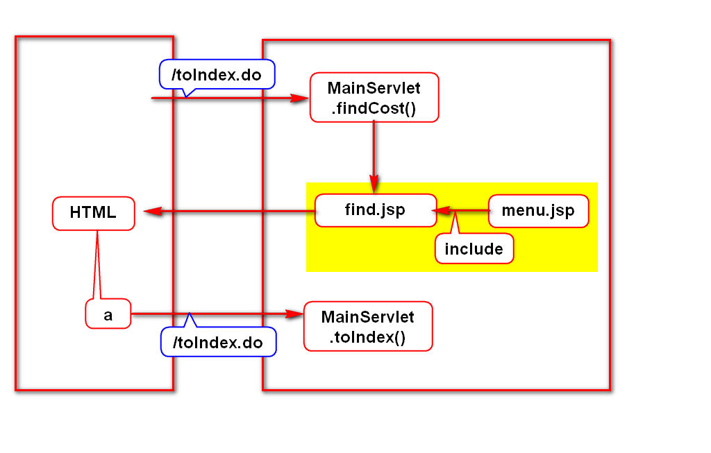
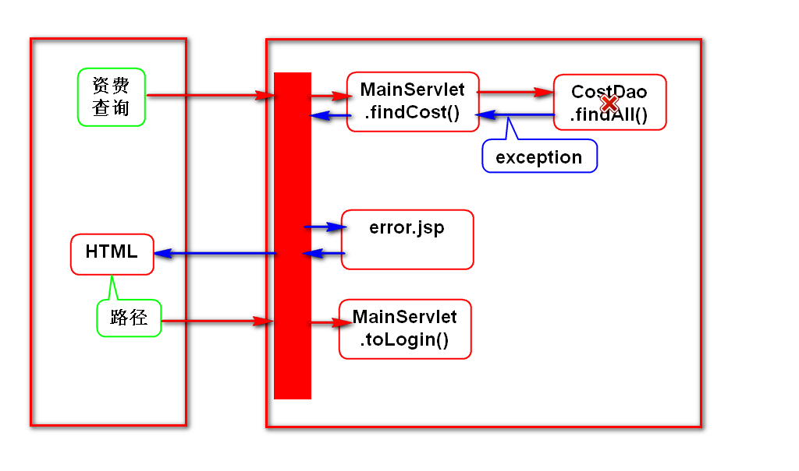
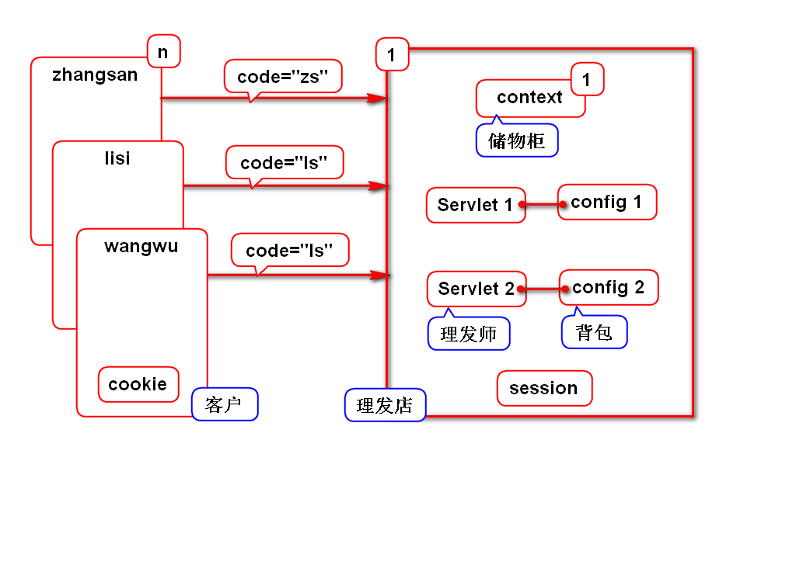
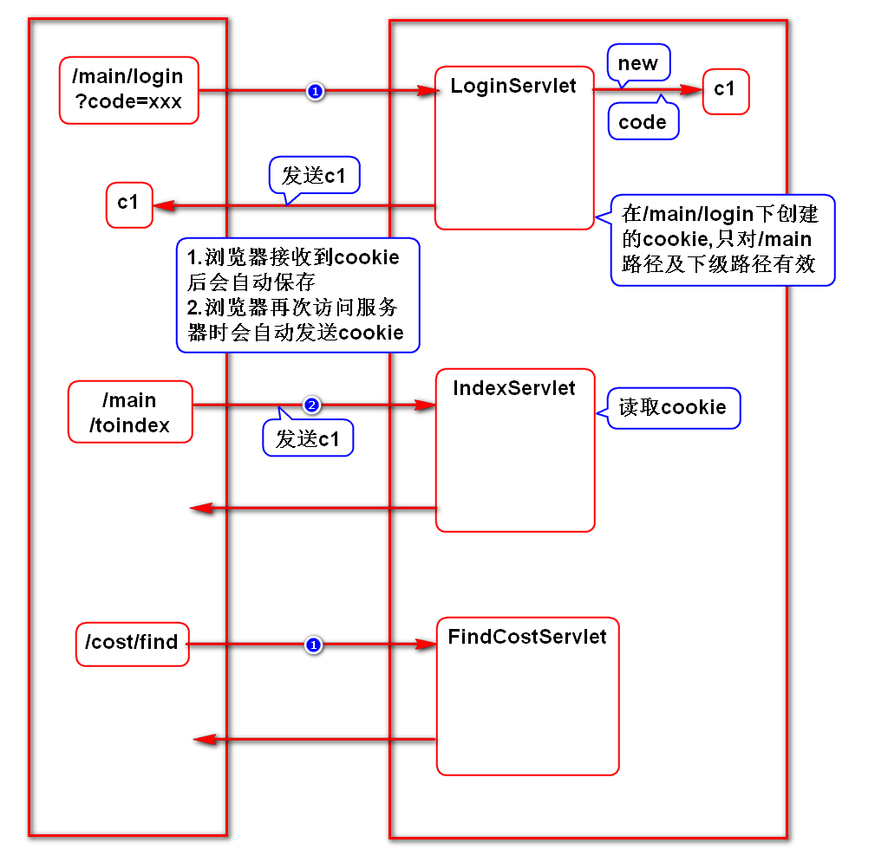
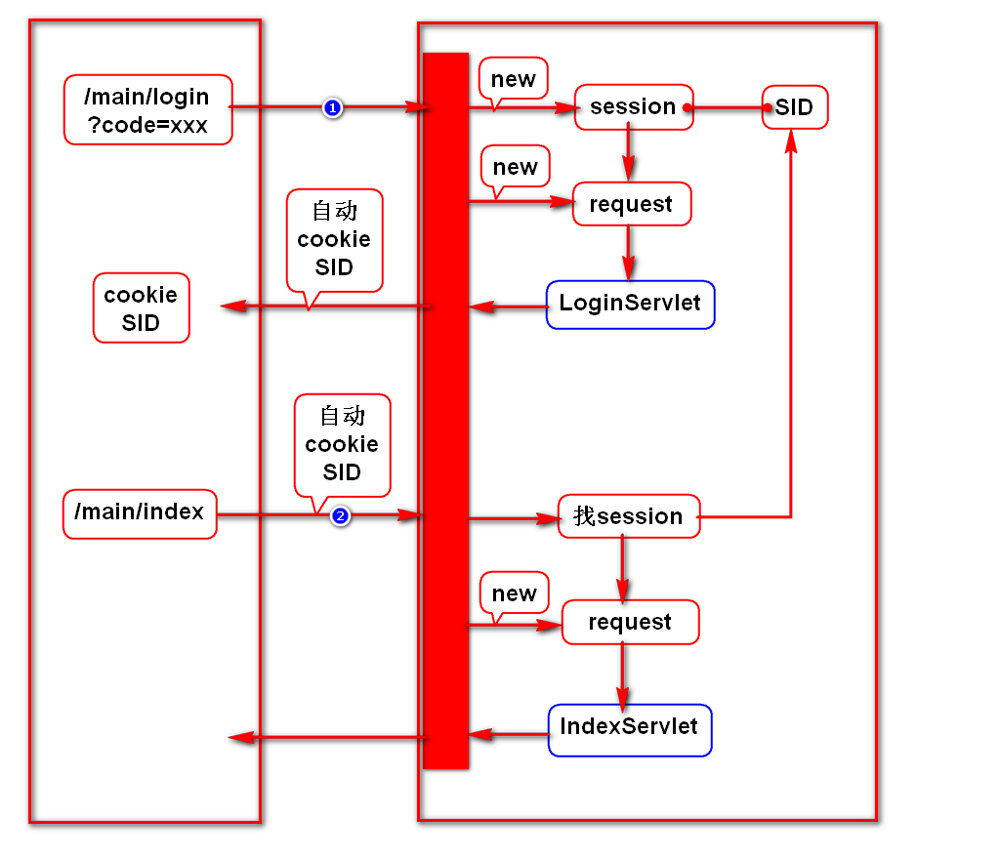

# 一.导航栏路径

# 二.错误页面路径

# 三.cookie和session简介
## 1.业务场景
- 登录时要记录账号
- 在后续的主页、查询、增加等页面上显示此账号

## 2.记录账号(错误的方式)
### request
- 登录是一个请求,对应一个request
- 查询是另一个请求,对应另一个request
- 2次请求无法通过不同的request传递数据

### config
- 有可能登录是一个Servlet,查询是另一个Servlet
- 2个Servlet对应2个config,无法通过它传递数据
> 事实上config不具备存取变量的能力

### context
- 浏览器和服务器是对多一的关系
- 每个人访问服务器传入的值不同,但名称相同
- 项目内只有一个context,存这些名称相同的数据是会冲突的

## 3.记录账号(正确的方式)
- 使用cookie或session记录账号:
- 它们内部的数据可以在多个请求间共用
- 它们内部的数据可以在多个Servlet间共用
- 服务器会给每个浏览器创建一份cookie和session
> 上述规则由服务器保障.

## 4.它们的区别
- cookie存储在浏览器上,不安全,但服务器压力小.
- session存储在服务器上,安全,但服务器压力大.

# 四.cookie
## 1.基本语法
- 创建cookie
- 发送cookie
- 读取cookie

## 2.一些规则
- 生存时间
- 存储中文
- 生效路径

# 五.session
