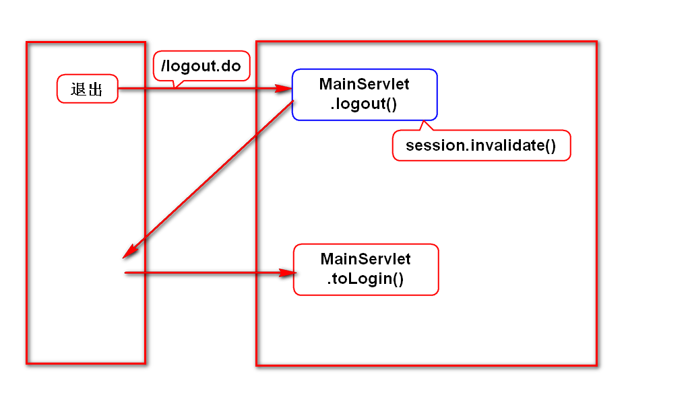
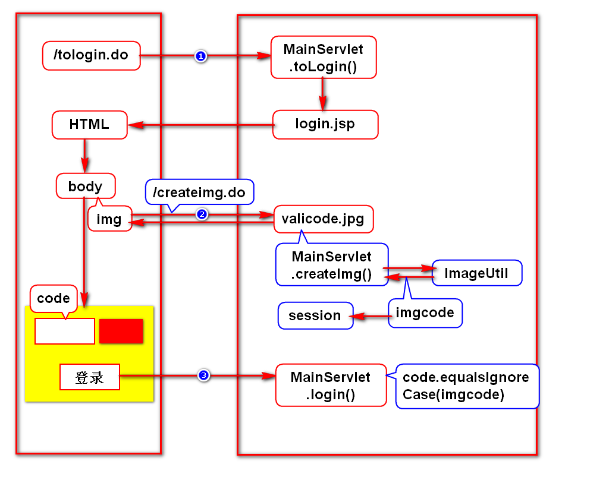
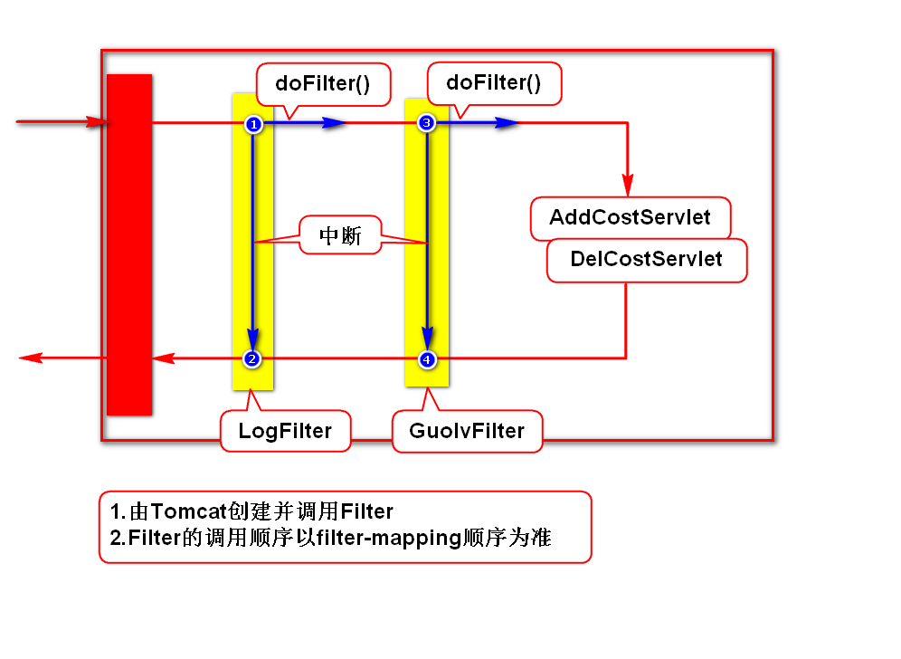
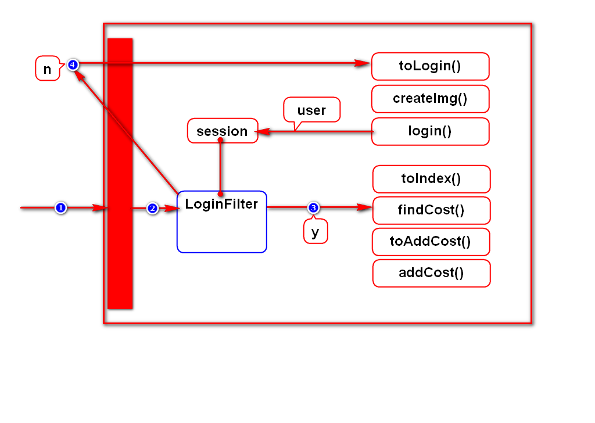
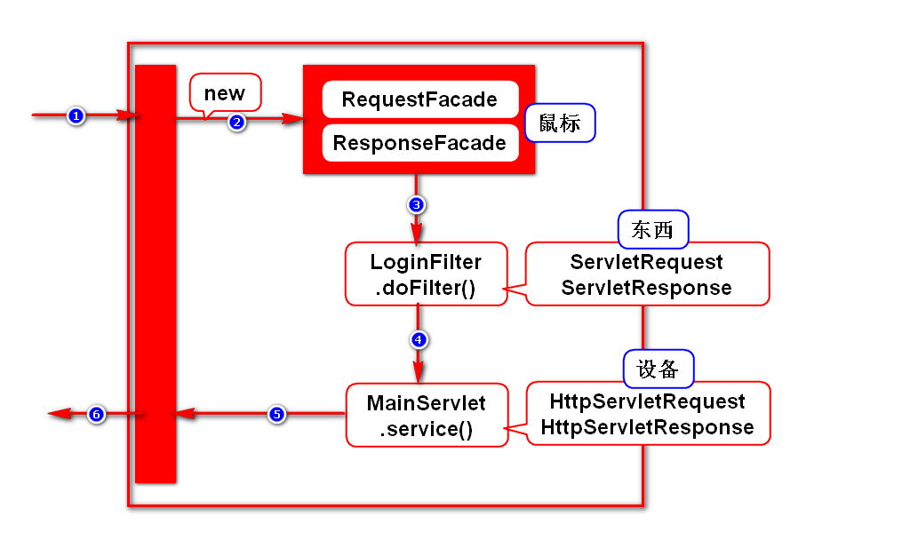

# 一.session
## 1.基本语法
- 如何获取session
- 如何存取数据
- 如何销毁session

## 2.扩展规则
- session的超时时间
- 如何禁用cookie怎么办:URL重写

## 3.退出案例

# 二.cookie和session总结
## 1.通俗的理解
- 它们都能用来临时存储数据,并具备如下特征:
- 所存数据可以在多个请求间共用.
- 所存数据可以在多个Servlet间共用.
- 每个浏览器会有一份单独的cookie和session.

## 2.专业的理解
- HTTP协议是一个无状态协议,即协议没有要求服务器记住浏览器.
- cookie和session就是用来让服务器记住浏览器的手段,即用来管理状态的.
> 状态:服务器记住浏览器的证据(数据).

# 三.验证码

# 四.过滤器
## 1.作用
- 用来解决项目中公共的业务
- 如:记录日志、过滤敏感词、登录检查
> 公共的业务:很多请求中都包含的业务

## 2.开发步骤
- 创建一个类,实现Filter接口
- 在web.xml中配置此类

## 3.小案例

## 4.登录检查

## 5.参数说明

# 五.监听器
## 1.什么监听器
- 用来监听事件,当某事件发生时,它会通知服务器.
- 实际上它就是个对象,服务器会在某事发生时调用它.
> 它只能监听3个对象.

## 2.分类(接口)
### request
- ServletRequestListener:监听request的创建与销毁
- ServletRequestAttributeListener:监听request的数据变化

### session
- HttpSessionListener:监听session的创建与销毁
- HttpSessionAttributeListener:监听session的数据变化

### context
- ServletContextListener:监听context的创建与销毁
- ServletContextAttributeListener:监听context的数据变化

## 3.开发步骤
- 创建监听器实现类,实现对应的接口
- 在web.xml中配置此类