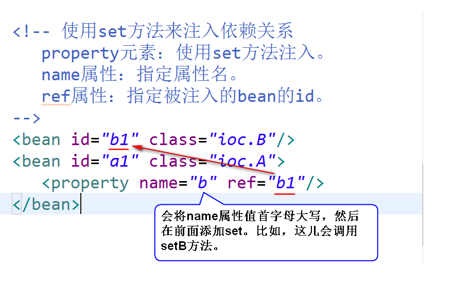

#  1. Spring是什么?
	开源的，用来简化企业级应用开发的应用开发框架。
	注：
	a.简化开发：
		spring对常用的api都做了一些简化和封装（比如，使用spring jdbc来访问数据库，就不再需要考虑如何获取连接和关闭连接了）。
	b.解耦:
		spring帮我们管理对象之间的依赖关系，这样对象之间的耦合度低，
		方便代码的维护。
	c.集成其它框架:
		spring可以将其它的一些框架集成进来（比如，可以将Mybatis等
		框架集成进来）

# 2. Spring容器
## (1)Spring容器是什么?
	spring框架当中的一个核心模块，用来管理对象（包括对象的创建，
	销毁，初始化等等）
## (2)如何启动Spring容器?
	step1. 导包。
	step2. 添加配置文件。
	step3. 启动容器。
## (3)如何创建对象？（让Spring容器依据配置文件创建对象）
### 1)方式一  无参构造器（或者缺省构造器）
	step1. 为类添加无参构造器（或者缺省构造器)。
	step2. 在配置文件当中，添加一个bean元素。
	step3. 启动容器，调用容器的getBean方法来获得对象。
### 2)方式二  静态工厂方法 （了解）
	注：通过调用类的静态方法来创建对象。		
### 3)方式三  实例工厂方法  （了解）
	注：通过调用对象的实例方法来创建对象。
## (4)生命周期的管理
### 1)初始化 （分配资源）
### 2)销毁    (回收资源)
	注：只有当作用域为"singleton"时，销毁方法才起作用。
## (5)作用域
### 1)默认情况下，对于某个bean元素，容器只会创建一个实例。
### 2)如果要创建多个实例，可以将作用域设置为"prototype"。
	注：默认的作用域是"singleton"。单例 
## (6)延迟加载 （了解）
	1)默认情况下，容器启动之后，会将所有作用域为"singleton"的bean实例。
	2)所谓延迟加载，指的是容器启动之后，不再实例化作用域为"singleton"
	的bean。

# 3.IOC和DI
## (1)IOC是什么(Inversion Of Controll 控制反转)?
	对象之间的依赖关系由容器来建立。
## (2)DI是什么 (Dependency Inject 依赖注入)?
	容器通过调用set方法或者构造器来建立对象之间的依赖关系。
	注：
		IOC是目标，DI是手段。

## (3)依赖注入的两种方式
### 1)set方法
	step1. 为类添加set方法。
	step2. 在配置文件当中，使用<property>元素来配置
		依赖注入。

### 以上配置的执行过程见下图

			 
		

		
		
		