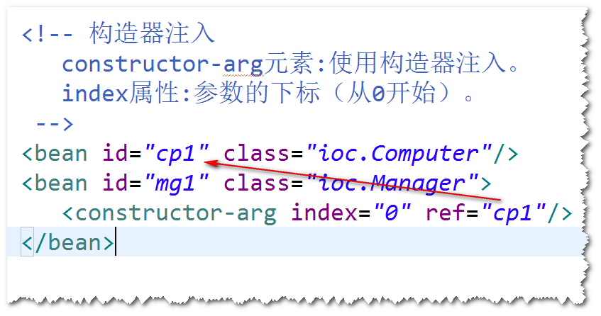
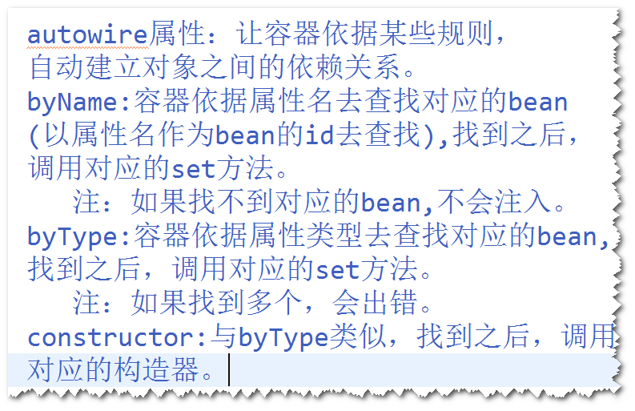
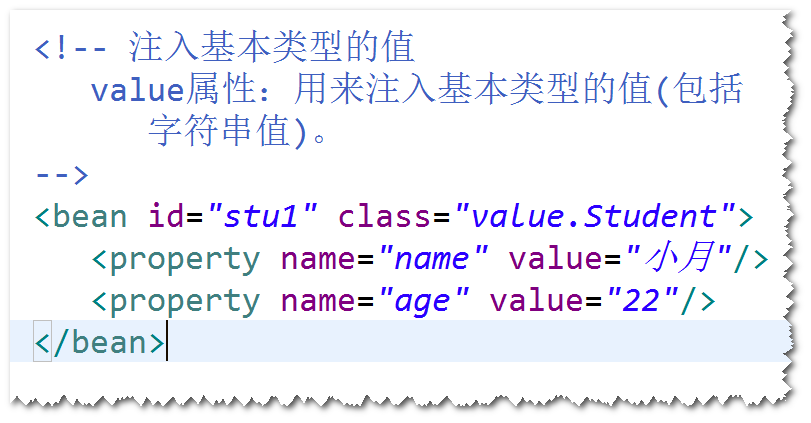
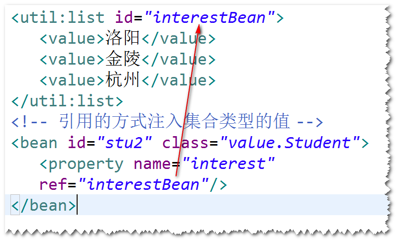
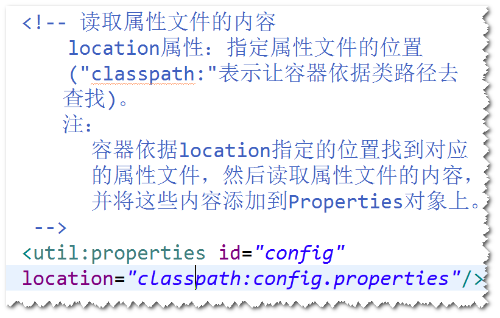

### 2)构造器注入
	step1. 添加相应的构造器。
	step2. <constructor-arg>元素配置构造器注入。

## 1. 自动装配（了解）
	1)默认情况下，容器不会自动装配。
	2)自动装配，指的是容器依据某些规则，自动建立对象之间的依赖
	关系。
		注：容器仍然要通过调用set方法或者构造器来建立依赖关系。

	3)建议使用byName。

## 2. 注入基本类型的值

## 3. 注入集合类型的值
	使用list,set,map,props元素来注入List,Set,Map,Properties。

## 4. 引用的方式注入集合类型的值
	step1.先将集合类型的值配置成一个bean。
	step2.使用ref属性来注入这个bean。

## 5. 读取属性文件(.properties文件)
	

