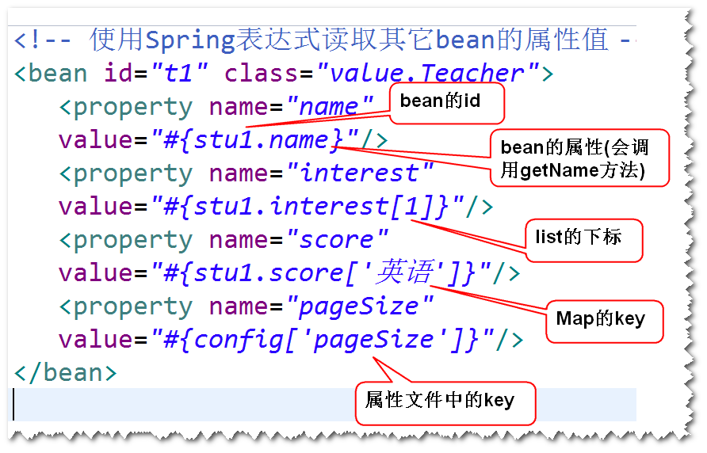
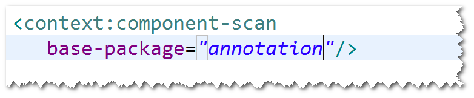
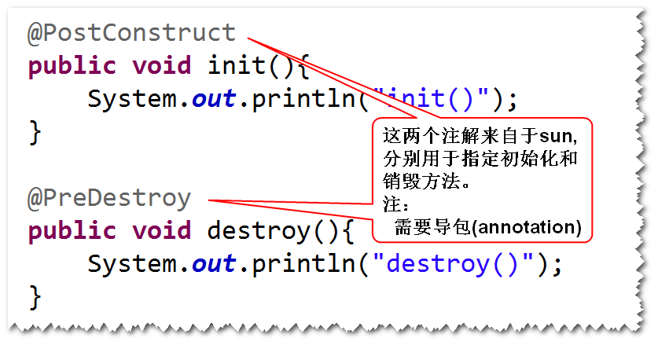

## 6. Spring表达式
### 1)Spring表达式的作用
	用于读取其它bean的属性值以及集合类型的值
### 2)基本用法

# 1.使用注解简化配置文件
## (1)组件扫描
	1)什么是组件扫描?
	Spring容器启动之后，会检查某个包以及子包下面的所有的类，
	如果该类前面添加了一些特定的注解，则容器会将该类纳入容器
	进行管理（相当于在配置文件当中有一个对应的bean元素）。
	2)如何进行组件扫描?
	step1. 在配置文件当中，添加

	step2. 在类前面添加一些特定的注解
	

## (2)生命周期相关的注解
	

## (3)延迟加载和作用域相关的注解
	

## (4)依赖注入相关的注解
### 1)@Autowired和@Qualifier
	a.这两个注解支持构造器注入和set方法注入。
	b.如果是set方法注入，可以将该注解添加到set方法前或者
	也可以直接添加到属性前。

	
	c.@Qualifier如果不加的话，会按照byType的方式来自动装配，
	就有可能找到多个，建议最好使用该注解，明确指定被注入的bean
	的id。
### 2)@Resource
	a.只支持set方法的注入
	b.使用name属性指定被注入的bean的id

## (5)注入基本类型的值的相关的注解

# 2. SpringMVC
## (1)SpringMVC是什么?
	是一个用来简化基于MVC架构的web应用程序开发的框架。
	注：SpringMVC属于Spring框架的一部分。
## (2)五大组件
	DispatcherServlet  前端控制器
	HandlerMapping  映射处理器
	Controller	处理器
	ModelAndView 模型和视图
	ViewResolver 视图解析器

### 五大组件的关系
	a. DispatcherServlet收到请求之后（比如xxx.do）,会依据
	HandlerMapping的配置，去调用相应的Controller来处理。
	b. Controller将处理结果封装成ModelAndView对象，然后将该
	对象返回给DispatcherServlet。
	c. DispatcherServlet依据ViewResolver的解析，调用相应的
	jsp来展现。

## (3)编程步骤
	step1. 导包。
		spring-webmvc
	step2. 添加Spring配置文件。
	step3. 配置DispatcherServlet。
	step4. 写Controller类。
	step5. 写jsp。
	step6. 配置HandlerMapping和ViewResolver。
			
	

	

		 		