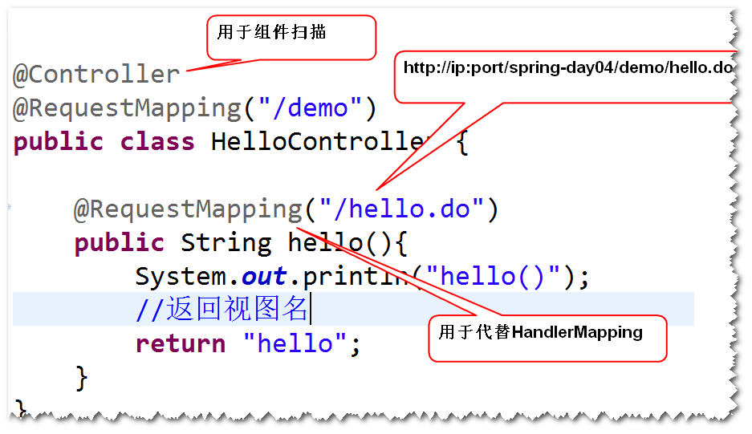
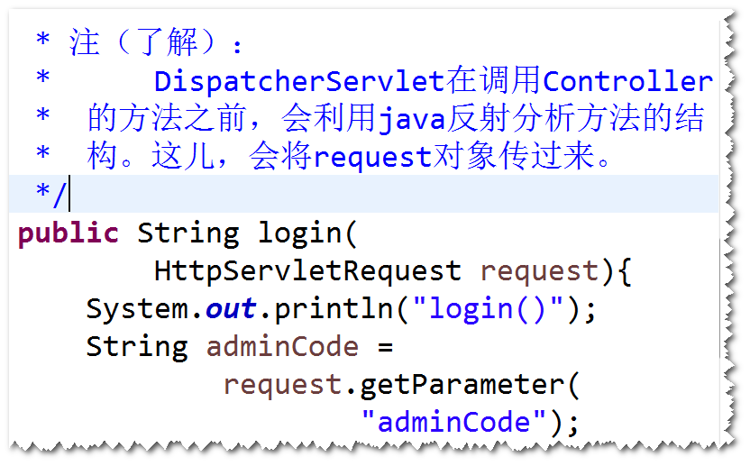
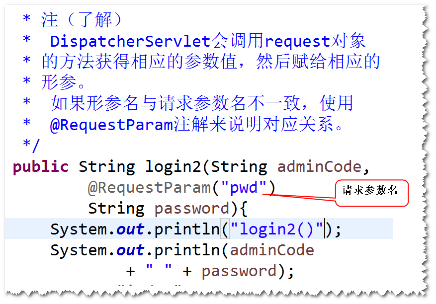
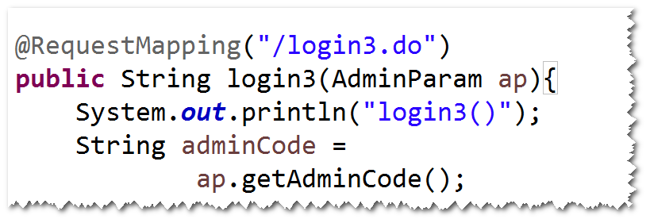
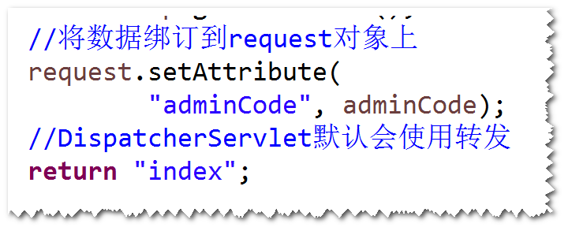
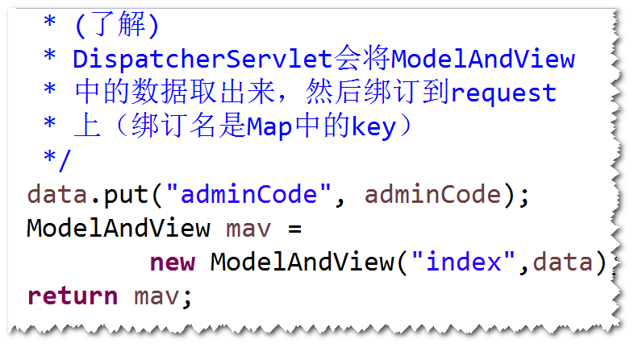
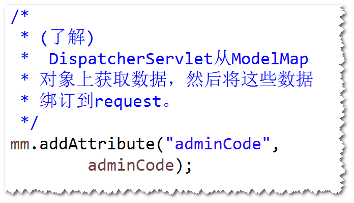
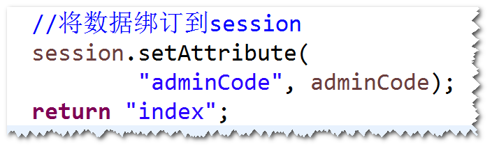

# 1. 基于注解的SpringMVC应用
	step1.导包
		spring-webmvc
	step2.添加配置文件	spring-mvc.xml
	step3.配置DispatcherServlet
	step4.Controller
		a. 不用实现Controller接口
		b. 可以添加多个方法
			注：一个方法处理一个请求
		c. 方法名不做要求，返回值可以是ModelAndView,
			也可以是String。
		d. 将@Controller注解添加到类前。
			注：用于组件扫描。
		e. 将@RequestMapping注解添加到类前或者方法前。
			注：用来代替HandlerMapping。

	step5. jsp
	step6. 在配置文件里面，添加
			ViewResolver,组件扫描，mvc注解扫描
			注：如果要让@RequestMapping起作用，需要添加
				mvc注解扫描。
		
# 2. 读取请求参数值
## 1)通过request

## 2)通过@RequestParam注解

## 3)通过javabean
	step1. 写一个java类
		属性名与请求参数名一致，并且提供相应的get/set方法。

	step2. 将该java类作为方法参数。

	

# 3. 向页面传值
## 1)将数据绑订到request
	

## 2)返回ModelAndView

## 3)将数据添加到ModelMap

## 4)将数据绑订到session
		

# 4. 重定向
## 1)处理器方法的返回值是String
	在重定向地址前添加 "redirect:"
	比如:
		return "redirect:toIndex.do";
## 2)处理器方法的返回值是ModelAndView
	RedirectView rv = 
			new RedirectView("toIndex.do");
	ModelAndView mav = 
			new ModelAndView(rv);
	return mav;
	

	