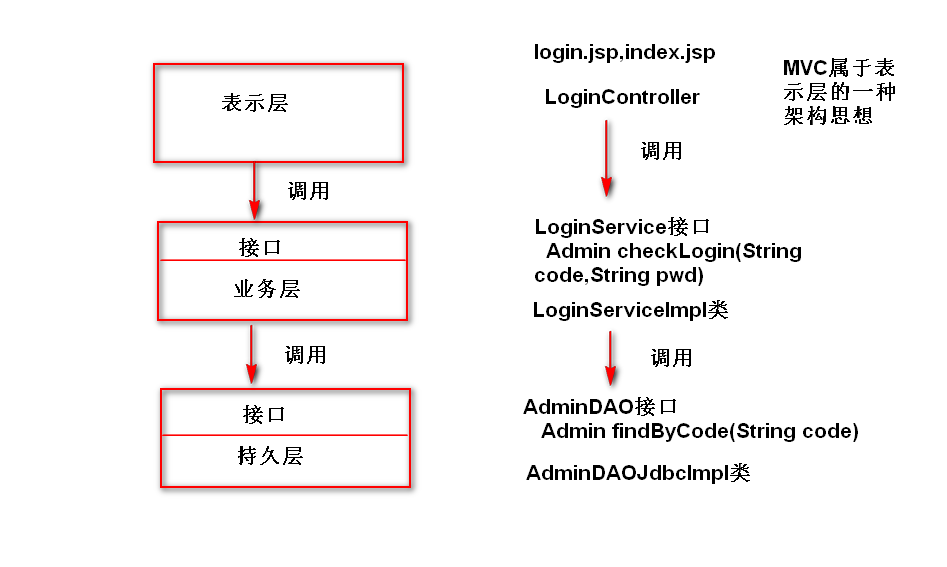

# 1. 系统分层 （扩展）
## 1)为什么要分层?
	为了方便代码的维护，需要保证类的职责要单一，这样
	就产生了分层（将一个类拆分成多个类，形成类之间的调用关系）。
## 2)如何分层?
	表示层(UI层): 数据展现和操作界面，另外，还要负责请求分发。
	业务层(服务层):  封装业务逻辑。
	持久层(数据访问层): 封装数据访问逻辑。
	注:
		a. 表示层调用业务层，业务层调用持久层。
		b. 上一层要通过接口来调用下一层（这样，下一层的实现发生了
		改变，不影响上一层）。
	
   	

