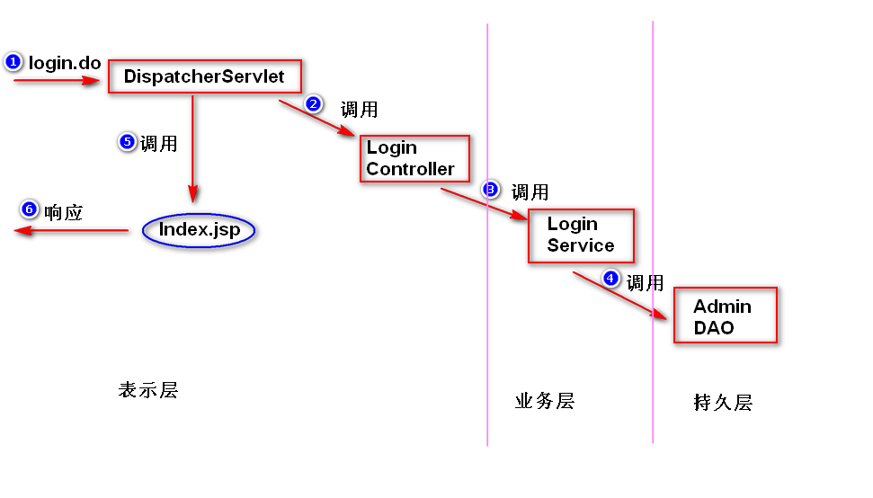
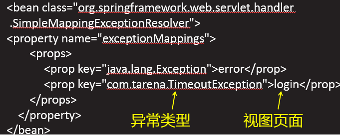

# 1. 系统分层 （扩展）
## 1)为什么要分层?
	为了方便代码的维护，需要保证类的职责要单一，这样
	就产生了分层（将一个类拆分成多个类，形成类之间的调用关系）。
## 2)如何分层?
	表示层(UI层): 数据展现和操作界面，另外，还要负责请求分发。
	业务层(服务层):  封装业务逻辑。
	持久层(数据访问层): 封装数据访问逻辑。
	注:
		a. 表示层调用业务层，业务层调用持久层。
		b. 上一层要通过接口来调用下一层（这样，下一层的实现发生了
		改变，不影响上一层）。
## 3)分层之后的好处
	a.方便代码的维护
		下一层的实现发生改变，不影响上一层。
	b.方便测试
	c.方便分工协作 

	

# 2. 表单中文参数值乱码问题
## 1)为什么会有乱码
	表单提交时，浏览器会对中文参数值进行编码。服务器端默认
	会使用iso-8859-1来解码。所以会产生乱码。
	注：
		浏览器会使用打开该表单所在页面时的字符集来解码。
## 2)如何解决
	配置SpringMVC提供的过滤器(CharacterEncodingFilter)。
	注意：
	a.表单提交方式必须为post
	b.编码设置要与客户端一致

# 3.拦截器
## 1)什么是拦截器?
	spring框架提供的一个组件，当DispatcherServlet收到请求之后，
	如果有拦截器，会先调用拦截器，然后再调用处理器(Controller)。
	注：
		过滤器属于Servlet规范，用于拦截Servlet容器的调用过程；
		而拦截器属于spring框架，用于拦截DispatcherServlet的调用过程。
## 2)如何写拦截器?
	step1. 写一个java类，实现HandlerInterceptor接口。
	step2. 在拦截器接口方法当中，实现拦截处理逻辑。

	step3. 配置拦截器。

## 3)拦截器的优先级
	当有多个拦截器都满足拦截要求，则依据配置的先后顺序来执行。
	

# 4.异常处理
	将异常抛给SpringMVC框架(抛给DispatcherServlet)，由Spring
	来帮我们处理。
## 1)方式一  配置简单异常处理器。
	step1. 配置简单异常处理器。

	step2. 添加异常处理页面。

## 2)方式二  @ExceptionHandler。	
	step1. 添加一个异常处理方法。
	注： 在处理器(Controller)添加一个方法，该方法
	需要添加@ExceptionHandler注解。该方法专门用来
	处理其它方法所抛出的异常。

	
	step2. 添加异常处理页面。
		