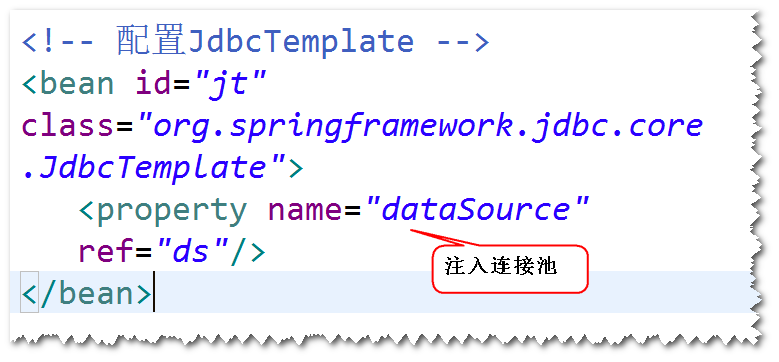
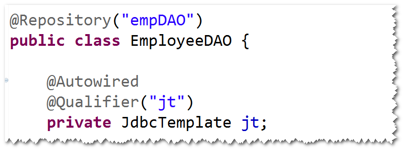
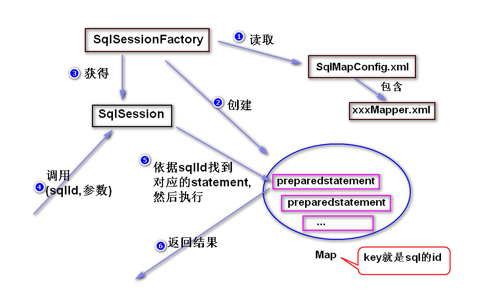

# 1.SpringJdbc
## 1)SpringJdbc是什么?
	Spring框架对jdbc的封装。
	注：
		封装的目的是为了简化代码，提高代码质量。比如，
	使用SpringJdbc访问数据库，就不再需要考虑如何获取连接，
	关闭连接等等。
## 2)如何使用SpringJdbc?
	step1.导包。
		spring-webmvc,spring-jdbc,
		ojdbc,dbcp,junit
	step2.添加配置文件。
	step3.配置JdbcTemplate。 

	step4.调用JdbcTemplate提供的方法来访问数据库。
	注：通常将JdbcTemplate注入到DAO。

	create table t_emp(
		id number(8) primary key,
		name varchar2(50),
		salary number(8,2),
		age number(3)
	);
	create sequence t_emp_seq;

# 2. MyBatis
## 1)什么是MyBatis?
	开源的持久层框架。
	注：MyBatis底层仍然是jdbc。
    (了解)
	jdbc  优点： 速度快，易掌握。 缺点：代码繁琐。
	Hibernate 优点：不用写sql,代码简洁。 
			  缺点：对于比较复杂的查询，生成的sql性能低下，
					需要优化。难掌握。
	MyBatis   优点：速度适中，代码简洁，易掌握。

## 2)如何使用MyBatis?
	step1. 导包。
	mybatis,ojdbc,junit。
	step2. 添加配置文件。
	step3. 实体类。
		注：属性名必须跟表的字段名一致（大小写可忽略）	。
	step4. 添加映射文件。
		注：主要是一些sql语句。
	step5.在配置文件当中，指定映射文件的位置。
	step6. 调用SqlSession提供的方法来访问数据库。
## 3)MyBatis的基本原理

	
				

	 

	
			