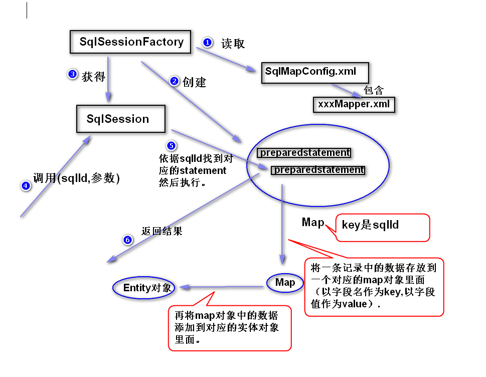
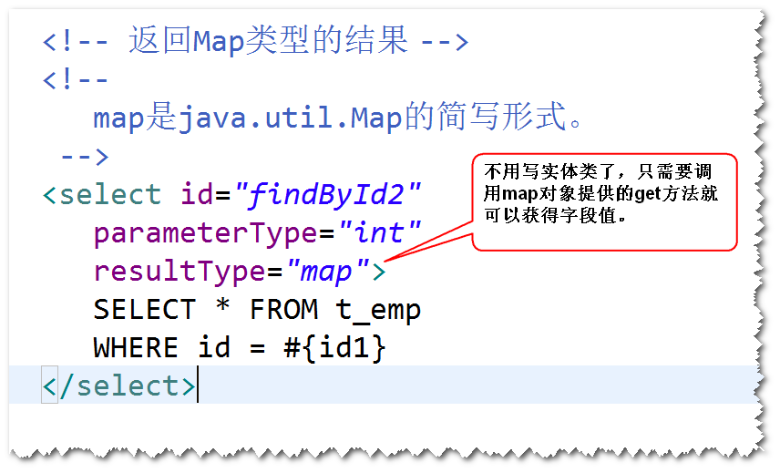
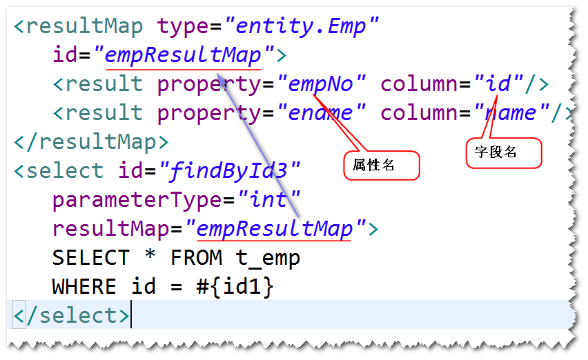
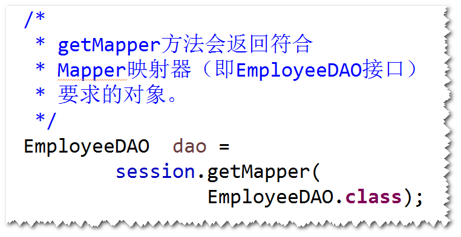
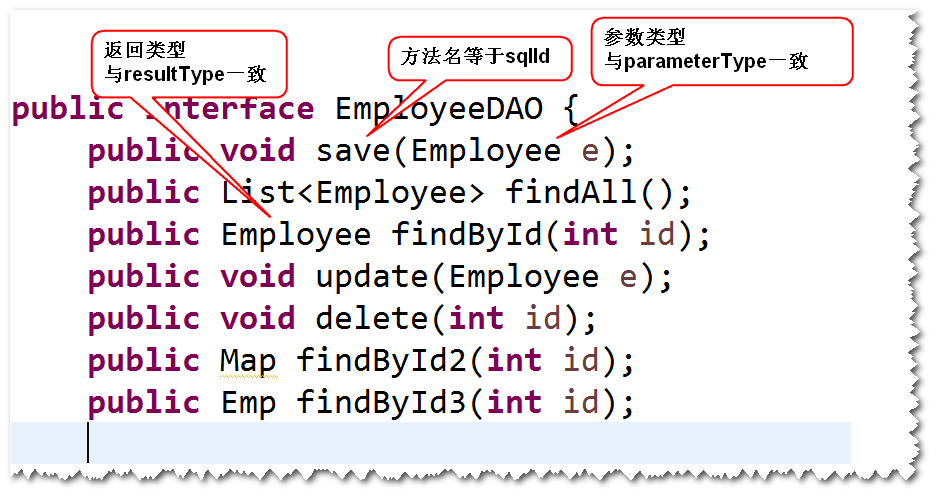
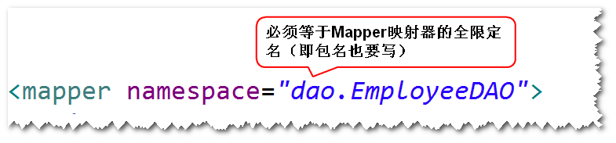

# 1. MyBatis的基本原理 (了解)

	注：  
	a.SqlSessionFactory通过读取MyBatis配置文件(SqlMapConfig.xml),
	创建一个Map（key是sql的id,值是PreparedStatement对象)。 
	b.调用SqlSession对象提供的方法来执行sql,SqlSession对象会依据
	sqlId在Map中找到对应的PreparedStatement对象，然后执行相应的
	方法（比如executeUpdate等）。 
	c.如果执行的是查询，对结果的处理分两步。第一步是将一条记录中存放
	的数据先添加到一个对应的Map对象里面（以字段名作为key,以字段值
	作为value）。第二步，会将Map对象存放的数据添加到对应的实体对象
	里面（这也是为什么要求实体类的属性名必须与表的字段名要求一致的
	原因）。

# 2. 返回Map类型的结果

# 3. 解决实体类的属性名与表的字段名不一致的情况。
## 1)方式一  使用别名
	以属性名作为字段名的别名
		select id empNo,name ename,salary,age FROM ...
## 2)方式二  使用resultMap
	

# 4. Mapper映射器
## 1)Mapper映射器是什么?
	是一个符合映射文件要求的接口。
	注：MyBatis会自动生成一个符合该接口要求的对象，只需要
	调用该对象的方法，就可以访问数据库。
	

## 2)如何写一个Mapper映射器?
	a. 方法名必须跟sqlId一样。
	b. 参数类型必须跟parameterType一样。
	c. 返回值的类型必须跟resultType一样。

	d. 映射文件namespace必须等于接口名。

		