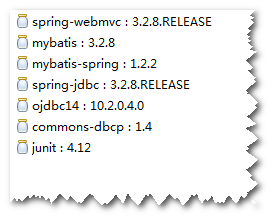
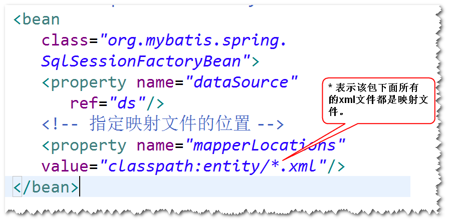
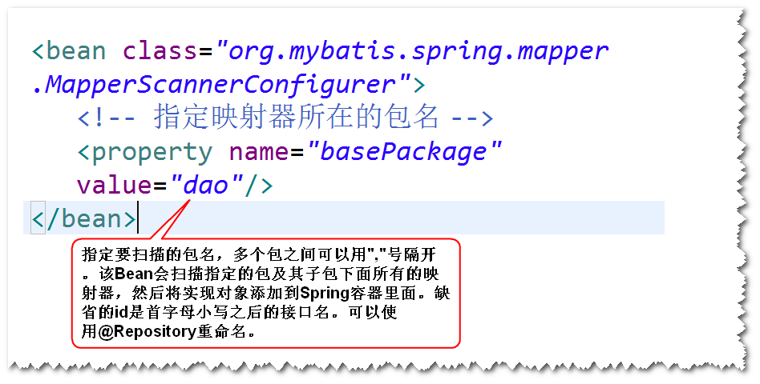
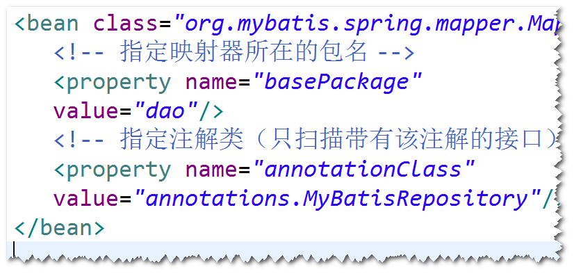
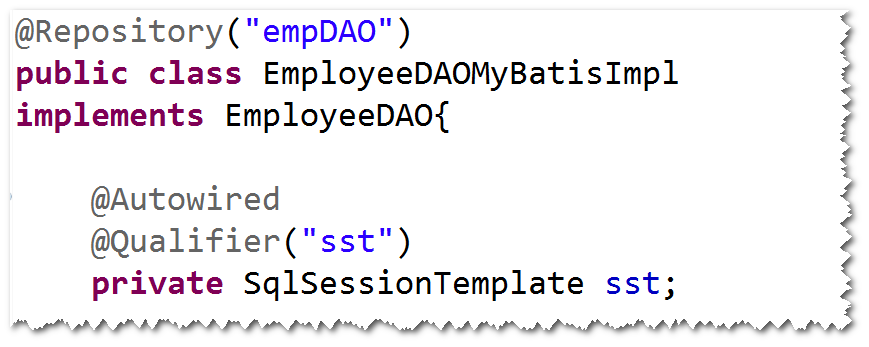
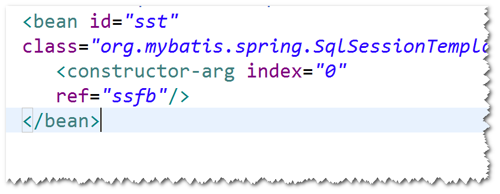

#　1.Spring集成MyBatis (使用Mapper映射器)
	step1. 导包
		spring-webmvc,mybatis,mybatis-spring,
		spring-jdbc,ojdbc,dbcp,junit

	step2. 添加Spring配置文件。
		注：MyBatis配置文件不再需要了，
		使用SqlSessionFactoryBean来代替。

	step3.实体类
	step4.映射文件
	step5.Mapper映射器
	step6.　配置MapperScannerConfigurer
		注：该bean会调用sqlsession的getMapper方法来获得
		映射器的实现对象，并且会将这些对象添加到Spring容器
		里面(默认的id是首字母小写之后的接口名)。

# 2. 只扫描特定的映射器
	step1.开发一个注解。  
	step2.将该注解添加到要扫描的接口上面。
	step3.修改MapperScannerConfigurer的配置。
	

# 3.Spring集成MyBatis的第二种方式　（不使用Mapper映射器  了解即可）
	step1. 导包
		spring-webmvc,mybatis,mybatis-spring,
		spring-jdbc,ojdbc,dbcp,junit

	step2. 添加Spring配置文件。
		注：MyBatis配置文件不再需要了，
		使用SqlSessionFactoryBean来代替。

	step3.实体类
	step4.映射文件
		注：namespace不做要求。
	step5.dao接口
		注：不要求与映射文件一致。
	step6.dao实现类。
		注：注入SqlSessionTemplate来简化实现,SqlSessionTemplate
			封装了SqlSession的api。

		
	
		