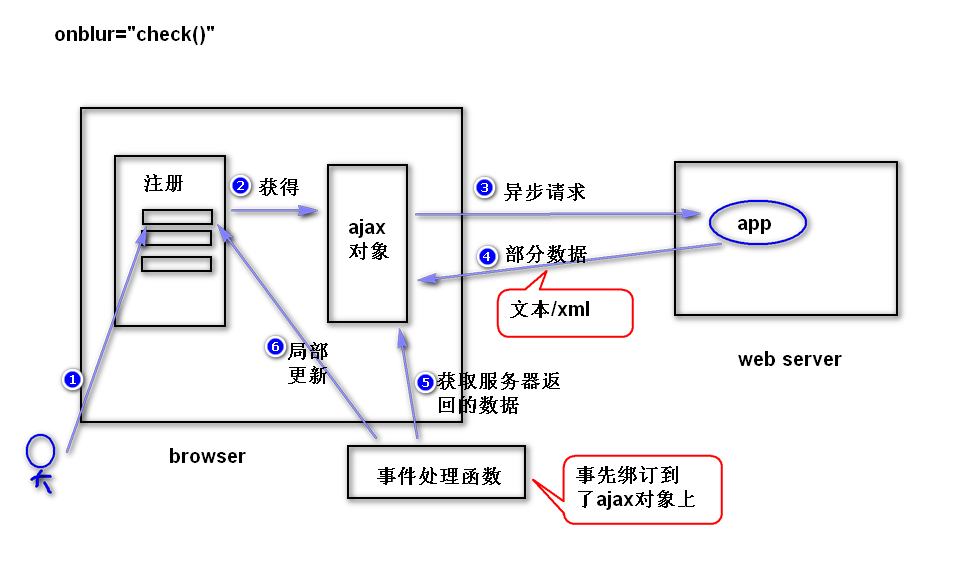

# 1. ajax （asynchronous javascript and xml 异步的）
## (1)ajax是什么?
	是一种用来改善用户体验的技术，本质是利用浏览器提供的一个
	特殊对象（ajax对象，即XMLHttpRequest对象）向服务器发送
	异步请求；服务器返回部分数据，浏览器利用这些数据对当前页
	面做局部更新；整个过程，页面无刷新，不打断用户的操作。
	注：
	异步请求，指的是，当ajax对象在向服务器发送请求时，浏览器
	并不会销毁当前页面，用户仍然可以对当前页面做其它操作。

## (2)如何获得ajax对象?
	function getAjax(){
		var xhr = null;
		if(window.XMLHttpRequest){
			//非ie浏览器
			xhr = new XMLHttpRequest();	
		}else{
			xhr = new ActiveXObject('MicroSoft.XMLHttp');
		}
		return xhr;
	}

## (3)ajax对象的几个重要属性
	1)onreadystatechange:绑订事件处理函数（用来处理readystatechange事件）
		注：当readyState属性值发生了任何改变（比如从０变成了１）,就会产生readystatechange事件。
	2)readyState:有５个值(0,1,2,3,4)，用来获得ajax对象与服务器通信
		的进展。（当值是4的时候，表示ajax对象已经获得了服务器返回的
		所有的数据）。
	3)responseText:获得服务器返回的文本数据。
	4)responseXML:获得服务器返回的xml数据。
	5)status:获得状态码。

## (4)编程步骤
###	step1.获得ajax对象，比如
	  var xhr = getAjax();

###	step2.调用ajax对象的方法发送请求。
	方式一	发送get请求
		xhr.open(请求类型,请求地址,同步/异步);
		xhr.onreadystatechange = 事件处理函数。
		xhr.send(null);
		注：
			同步：当ajax对象发送请求时，浏览器会锁定当前
			页面（用户对当前页面不能够做任何操作）。
			建议少用。
	比如：
		xhr.open('get','check.do?uname=Sally',true);
		xhr.onreadystatechange = f1;
		xhr.send(null);

	方式二　发送post请求	
		xhr.open('post','check.do',true);
		xhr.setRequestHeader('content-type',
		'application/x-www-form-urlencoded');
		xhr.onreadystatechange = f1;  
		xhr.send('uname=Sally');
	注：（了解）
		按照http协议要求，如果发送的是post请求，请求数据包
		应该包含一个消息头('content-type')。但是，ajax对象
		默认发送的数据包是不带这个消息头的，所以，需要调用
		setRequestHeader方法。
	
###	step3.	编写服务器端程序
			注：只需要返回部分数据。
	
###	step4.  编写事件处理函数。
			if(xhr.readyState == 4 && 
				xhr.status == 200){
				//获得服务器返回的数据
				var txt = xhr.responseText;
				//更新页面
				...
			}
## (5)缓存问题　（了解）	
	1)什么是缓存问题?
		ie浏览器提供的ajax对象在发送get请求时，会比较请求地址是否
	访问过，如果该地址之前访问过，则不再发送新的请求，而是显示
	第一次访问的结果。
	2)如何解决?
		在请求地址后面，添加一个随机数。
		比如   getNumber.do?