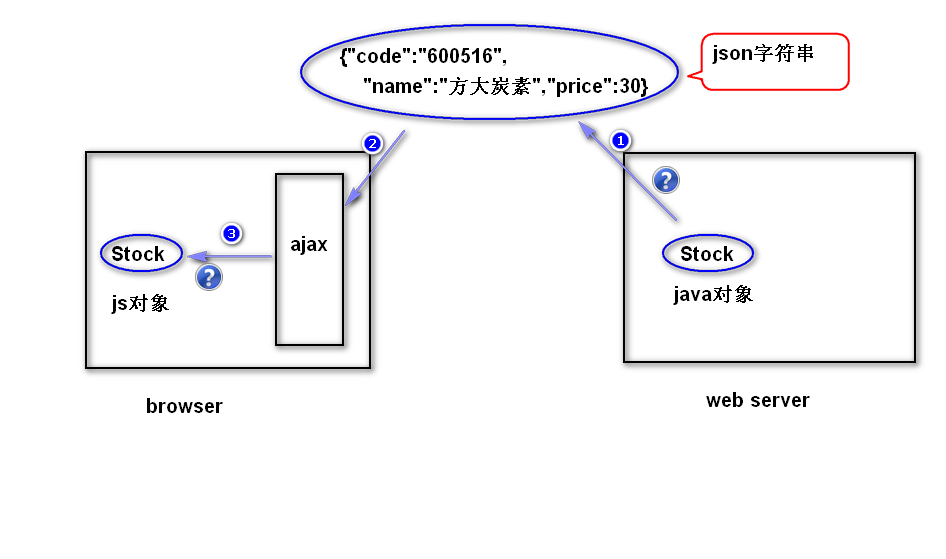

# 1. 编码问题
## 1)get请求
	a.为什么会有乱码?
	ie浏览器提供的ajax对象会使用gbk对中文参数值进行编码，而其它
	浏览器会使用utf-8来编码。服务器端默认会使用iso-8859-1来解码，
	所以，会产生乱码。
	b.如何解决?
		step1.　服务器端统一使用utf-8来解码。
		比如:
			<Connector URIEncoding="utf-8"/>
			注：以上配置只针对get请求有效。
		step2. 在客户端（浏览器）使用encodeURI函数对
			中文进行编码。
			注：encodeURI函数是javascript内置的一个函数
			,该函数会使用utf-8对中文进行编码。
## 2)post请求
	a.为什么会有乱码?
		浏览器提供的ajax对象对中文会使用utf-8来编码，而服务器
		端会使用iso-8859-1来解码。
	b.如何解决?
		request.setCharacterEncoding("utf-8");

# 2. JSON (javascript object notation)  
## 1)JSON是什么?	
	是一种轻量级的数据交换格式。
	注：
		数据交换:将数据转换成一种与平台无关的数据格式(比如xml),
		然后发送给接收方来处理。
		轻量级：json相对于xml，文档要小，而且解析速度更快。
## 2)JSON语法
### 表示一个对象
	{属性名：属性值，属性名：属性值...}
	注意：
		a.属性名必须使用双引号括起来。
		b.属性值可以number,string,true/false,null,object。
		c.如果属性值是string,必须使用双引号括起来。
### 表示对象组成的数组
	[{},{},{}...]	

## 3)使用JSON
	a.将java对象或者java对象组成的集合/数组转换成json字符串。
		使用jackson提供的api来转换的。
	注：
		还有别的选择，比如json官方的api(json-lib)
		www.json.org
	b.json字符串转换成javascript对象。
		使用javascript内置的一个对象JSON提供的parseJON来转换。
	注：
		还有别的选择，比如json官方的api, 还有一些js框架(jQuery)
		也提供了相应的方法来转换。

# 3. jQuery对ajax编程的支持
## 1) $.ajax方法
	用法:
		$.ajax({属性名:属性值...});
		属性名是一些选项参数，用于控制ajax对象如何向服务器发送
		请求。常见的一些选项参数如下：
		url  	请求地址
		type 	请求类型 (get/post)
		data 	请求参数
			注：请求参数有两种写法
				写法1:请求字符串形式，比如 "uname=Sally"
				写法2:对象形式，比如 {"uname":"Sally"}
		dataType 	服务器返回的数据类型
				注：数据类型有如下几种
				json  	json字符串
				text  	文本
				html  	html文档
				xml   	xml文档
				script  javascript脚本
		success		事件处理函数
				注：当服务器处理正确，并且已经将所有数据发送给了
				ajax对象，用该事件函数来处理服务器返回的数据。
		  
## 2)load方法
	作用：向服务器发送异步请求，并且将服务器返回的数据直接
		添加到符合要求的节点之上。
			
	用法:
		$obj.load(url,data);
		注：
			url 请求地址
			data 请求参数，有两种写法，同上。
		 		
	
				
		
						