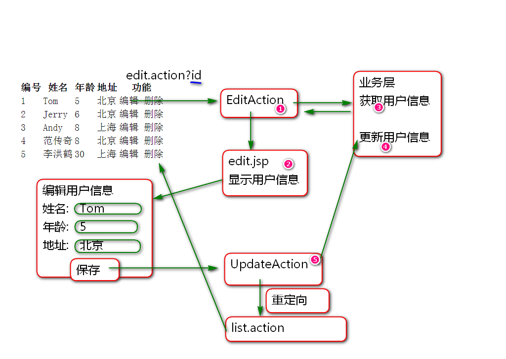

# SSH

## 添加用户功能

原理:

1. 创建/WEB-INF/jsp/user/add.jsp

		<%@ page contentType="text/html; charset=utf-8"
		    pageEncoding="UTF-8"%>
		<%@ taglib prefix="c" 
			uri="http://java.sun.com/jsp/jstl/core" %>
		<!DOCTYPE html>
		<html>
		<head>
		<meta charset="UTF-8">
		<title>添加用户</title>
		</head>
		<body>
			<h1>添加用户</h1>
			<c:import url="/WEB-INF/jsp/header.jsp"/>
			<form action="save.action" method="post">
				

					<label>姓名</label>
					<input name="name" type="text">
				

				

					<label>年龄</label>
					<input name="age" type="text">
				

				

					<label>地址</label>
					<input name="address" type="text">
				

				

					<input type="submit" value="保存">  
				

			</form>
		</body>
		</html>
	
2. 抽取统一的导航菜单 /WEB-INF/jsp/header.jsp:

		<%@ page contentType="text/html; charset=utf-8"
		    pageEncoding="UTF-8"%>
			

				<a href="list.action">全部用户</a>
				<a href="add.action">添加用户</a>
			
 

3. 添加控制器配置 struts-user.xml

		<!-- 显示添加界面 -->
		<action name="add">
			<result>
				/WEB-INF/jsp/user/add.jsp
			</result>
		</action>

4. 测试.

5. 添加控制器方法 UserAction

		private String name;
		private Integer age;
		private String address;
		
		public String getName() {
			return name;
		}
		public void setName(String name) {
			this.name = name;
		}
		public Integer getAge() {
			return age;
		}
		public void setAge(Integer age) {
			this.age = age;
		}
		public String getAddress() {
			return address;
		}
		public void setAddress(String address) {
			this.address = address;
		}
		public String save(){
			userService.save(name, age, address);
			return "success";
		}

6.添加业务层 方法 UserService

		void save(String name, Integer age, String address);

7. 实现业务层方法:
	
		public void save(String name, 
				Integer age, 
				String address) {
			if(name==null || name.trim().isEmpty()){
				throw new EmptyNameException(
						"用户名不能空");
			}
			if(age==null){
				age = 0;
			}
			if(address == null){
				address = "";
			}
			//Integer maxId = userDao.findMaxId();
			//Integer id = maxId+1;
			User user = new User(null, name, age, address);
			userDao.save(user); 
			System.out.println(user); 
		}

8. 重构 User.hbm.xml, 增加主键生成策略

		<id type="int" name="id" column="t_id">
			<!-- 主键ID的生成器 -->
			<generator class="org.hibernate.id.IncrementGenerator"></generator>
		</id>

9. 配置控制器 struts-user.xml

		<!-- 保存数据到数据库 -->
		<action name="save" class="userAction"
			method="save">
			<result name="success" 
				type="redirectAction"> 
				list
			</result>
		</action>

10. 测试

## Hibernate 主键生成

Hibernate 提供了ID生成规则支持, 支持 Oracle 序列, MySQL自增ID等, 这些自增ID算法都由Hibernate提供的类封装, 只需要在映射文件中配置即可, 添加用户时候这些ID不用赋值, 保持为null, 保存时候Hibernate会利用算法将ID值计算出来并且回填到实体对象中!

案例: 

1. 更新数据表:

		drop table t_user; 
		create table t_user(
			t_id int not null auto_increment,
			t_name varchar(100),
			t_age int,
			t_address varchar(200), 
			primary key(t_id)
		)

2. 更新映射文件:

		<id type="int" name="id" column="t_id">
			<!-- 主键ID的生成器 -->
			<!-- <generator class="org.hibernate.id.IncrementGenerator"></generator>
			-->
			<generator class="org.hibernate.id.IdentityGenerator"></generator>
		</id>

3. 更新 添加用户业务方法: 

		public void save(String name, 
				Integer age, 
				String address) {
			if(name==null || name.trim().isEmpty()){
				throw new EmptyNameException(
						"用户名不能空");
			}
			if(age==null){
				age = 0;
			}
			if(address == null){
				address = "";
			}
			//Integer maxId = userDao.findMaxId();
			//Integer id = maxId+1;
			User user = new User(null, name, age, address);
			userDao.save(user); 
			System.out.println(user); 
		}

4. 测试

## 更新用户信息功能

原理:

实现:

1. 添加控制器方法 UserAction

		private User user;
		public User getUser() {
			return user;
		}
		public void setUser(User user) {
			this.user = user;
		}
		
		public String edit(){
			user = userService.get(id);
			return "edit";
		}

2. 添加业务层方法 UserService

		User get(Integer id);

3. 实现业务层方法

		@Transactional
		public User get(Integer id) {
			if(id==null){
				throw new RuntimeException(
						"ID不能空!");
			}
			return userDao.findById(id); 
		}

4. 添加持久层方法 UserDao

		public User findById(Integer id);	

5. 实现持久层方法

		public User findById(Integer id) {
			return hibernateTemplate.get(User.class, id); 
		}

6. 添加编辑界面: edit.jsp

		<%@ page contentType="text/html; charset=utf-8"
		    pageEncoding="UTF-8"%>
		<%@ taglib prefix="c" 
			uri="http://java.sun.com/jsp/jstl/core" %>
		<%@ taglib prefix="s" uri="/struts-tags" %>
		<!DOCTYPE html>
		<html>
		<head>
		<meta charset="UTF-8">
		<title>编辑用户信息</title>
		<!-- edit.jsp -->
		</head>
		<body>
			<h1>编辑用户信息</h1>
			<c:import url="/WEB-INF/jsp/header.jsp"/>
			<form action="update.action" method="post">
				<input type="hidden" name="user.id" 
					value="${user.id}"> 
				

					<label>姓名</label>
					<input name="user.name" type="text"
						value="${user.name}">
					${nameError}
				

				

					<label>年龄</label>
					<input name="user.age" type="text"
						value="${user.age}">
				

				

					<label>地址</label>
					<input name="user.address" type="text"
						value="<s:property value="user.address"/>">
					 
				

				

					<input type="submit" value="保存">  
				

			</form>
			
			<s:debug></s:debug>
		</body>
		</html>

7. 配置控制器 

		<!-- 打开编辑用户信息的界面 -->
		<action name="edit" 
			class="userAction"
			method="edit">
			<result name="edit">
				/WEB-INF/jsp/user/edit.jsp
			</result>	
		</action>

8. 测试

9. 添加控制器 方法 UserAction

		public String update(){
			//id name age address
			try{
				//userService.update(
				//	id, name, age, address);
				userService.update(user.getId(),
						user.getName(), user.getAge(),
						user.getAddress());
				return "list";
			}catch(EmptyNameException e){
				e.printStackTrace();
				request.put("nameError", 
						e.getMessage());
				//user = new User(id, name, age, address);
				return "edit";
			}catch (Exception e) {
				e.printStackTrace();
				return "error";
			}
		}

10. 添加业务层方法 UserService

		void update(Integer id, String name, Integer age, String address);

11. 实现业务层方法 UserServiceImpl
	
		@Transactional
		public void update(Integer id, 
			String name, Integer age, 
			String address) {
			
			if(name==null||name.trim().isEmpty()){
				throw new EmptyNameException(
						"用户名不能空");
			}
			
			User user = userDao.findById(id);
			user.setAddress(address);
			user.getAge();
			user.setName(name);
			userDao.update(user);
		}

12. 配置控制器 struts-user.xml

		<action name="update"
			class="userAction"
			method="update">
			<result name="list"
				type="redirectAction">
				list
			</result>
			<result name="edit">
				/WEB-INF/jsp/user/edit.jsp
			</result>	
		</action>

13. 测试.

## Struts2 ValueStack 值栈

Struts2 中共享数据的存储结构:

1. 在用户请求以后创建ValueStack
2. 在一个用户请求流程期间有效
3. 可以在任何位置访问

ValueStack分为两个区域

1. 内容区域
2. 上下文区域

使用OGNL表达式可以读取 ValueStack 中的数据
1. 内容区域直接使用: user.address
	- 由上到下顺序读取数据, 同变量名的数据被覆盖了
2. 上下文区域: #session.loginUser
3. Struts2 底层将EL/JSTL转接到ValueStack上, EL/JSTL本身就可以读取ValueStack数据
	- ${user.address}
	- ${loginUser} 或 ${sessionScope.loginUser}

---------------------

## 作业

1. 完成用户信息添加和编辑功能
2. 完成用户信息删除功能

