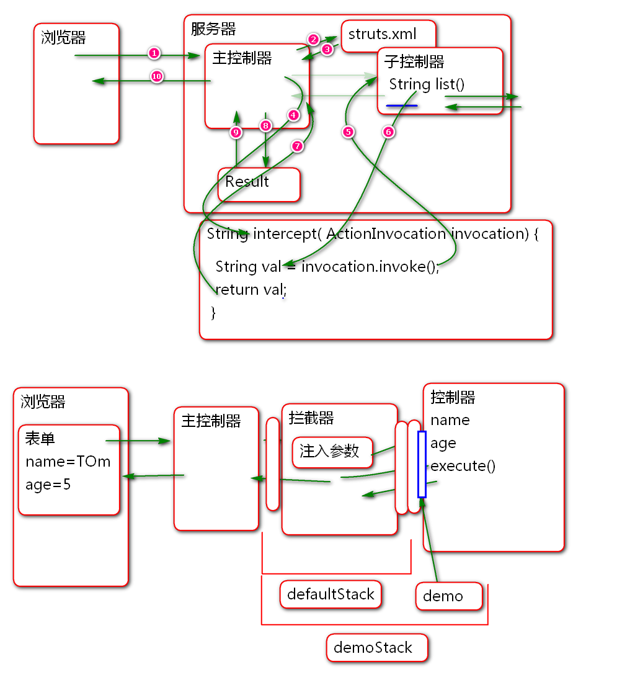

#SSH

## Hibernate复杂关系映射

发帖业务:

数据库表设计:
	
	create table p_user(
		u_id int not null auto_increment,
		u_name varchar(100), 
		u_password varchar(100),
		u_nick varchar(50),
		u_reg_date timestamp,
		primary key(u_id)
	); 
	
	insert into p_user (u_id, u_name, 
		u_password, u_nick, u_reg_date)values
		(null, '李洪鹤', '123', '李大湿', now());
	
	create table p_post(
		p_id int not null auto_increment,
		user_id int,
		p_time timestamp,
		p_content varchar(800),
		primary key(p_id)
	);
	
	insert into p_post (p_id, user_id, p_time,
		p_content) values (null, 1, now(), 
		'今天早晨看到大长腿, 嘿嘿!');
		
	insert into p_post (p_id, user_id, p_time,
		p_content) values (null, 1, now(), 
		'今天天气不错, 晒吐露皮了!');
		
	create table p_comment(
		c_id int not null auto_increment,
		post_id int,
		c_name varchar(100),
		c_time timestamp,
		c_content varchar(800),
		primary key(c_id)
	);
	
	insert into p_comment ( c_id, post_id, 
		c_name, c_time, c_content) values 
		(null, 1, '范传奇', now(), 
		'在哪个动物玩呢?');
		
	insert into p_comment ( c_id, post_id, 
		c_name, c_time, c_content) values 
		(null, 1, '王克晶', now(), 
		'李老师动物凶猛呀!');
		
	insert into p_comment ( c_id, post_id, 
		c_name, c_time, c_content) values 
		(null, 1, '范传奇', now(), 
		'请李老师附湿一首!'); 
		
实现复杂关系映射:

1. 创建项目
	- 导入 SSH 包

			<dependency>
			  <groupId>org.apache.struts</groupId>
			  <artifactId>struts2-core</artifactId>
			  <version>2.5.12</version>
			</dependency>  
		
			<dependency>
			  <groupId>org.apache.poi</groupId>
			  <artifactId>poi</artifactId>
			  <version>3.9</version>
			</dependency>
		
			<dependency>
			  <groupId>org.apache.struts</groupId>
			  <artifactId>struts2-json-plugin</artifactId>
			  <version>2.5.12</version>
			</dependency>
			
			<!-- 引入Spring, 将控制器对象的控制权
			交给Spring(IOC), 由Spring负责创建控制器
			对象,为控制器对象注入属性(业务层对象) -->
			<dependency>
			  <groupId>org.apache.struts</groupId>
			  <artifactId>struts2-spring-plugin</artifactId>
			  <version>2.5.12</version>
			</dependency>
			
			<dependency>
			  <groupId>org.hibernate</groupId>
			  <artifactId>hibernate-core</artifactId>
			  <version>4.3.9.Final</version>
			</dependency>
				<!-- 添加mysql驱动 (不要选5.1.6) -->
		
			<dependency>
				<groupId>mysql</groupId>
				<artifactId>mysql-connector-java</artifactId>
				<version>5.1.40</version>
			</dependency>
		
			<!-- 添加alibaba的druid连接池依赖 -->
			<dependency>
				<groupId>com.alibaba</groupId>
				<artifactId>druid</artifactId>
				<version>1.0.23</version>
			</dependency>
			
			<dependency>
			  <groupId>org.springframework</groupId>
			  <artifactId>spring-orm</artifactId>
			  <version>4.1.6.RELEASE</version>
			</dependency>
			
		
			<!-- 添加junit用于实现单元测试 -->
			<dependency>
				<groupId>junit</groupId>
				<artifactId>junit</artifactId>
				<version>4.12</version>
			</dependency>
			
		
			<dependency>
			  <groupId>jstl</groupId>
			  <artifactId>jstl</artifactId>
			  <version>1.2</version>
			</dependency>	

	- 配置 SSH 

			  <filter>
			    <display-name>StrutsPrepareAndExecuteFilter</display-name>
			    <filter-name>StrutsPrepareAndExecuteFilter</filter-name>
			    <filter-class>org.apache.struts2.dispatcher.filter.StrutsPrepareAndExecuteFilter</filter-class>
			  </filter>
			  <filter-mapping>
			    <filter-name>StrutsPrepareAndExecuteFilter</filter-name>
			    <url-pattern>/*</url-pattern>
			  </filter-mapping>
			  <listener>
			    <listener-class>org.springframework.web.context.ContextLoaderListener</listener-class>
			  </listener>
			  <context-param>
			  	 <param-name>contextConfigLocation</param-name>
			  	 <param-value>classpath:spring-*.xml</param-value>
			  </context-param>

2. 添加实体类

		public class User implements Serializable{
			private static final long serialVersionUID = -4278786782986241783L;
		
			private Integer id;
			private String name;
			private String password;
			private String nick;
			private Timestamp regDate;
			
			public User() {
			}
		
			public User(Integer id, String name, String password, String nick, Timestamp regDate) {
				super();
				this.id = id;
				this.name = name;
				this.password = password;
				this.nick = nick;
				this.regDate = regDate;
			}
		
			public Integer getId() {
				return id;
			}
		
			public void setId(Integer id) {
				this.id = id;
			}
		
			public String getName() {
				return name;
			}
		
			public void setName(String name) {
				this.name = name;
			}
		
			public String getPassword() {
				return password;
			}
		
			public void setPassword(String password) {
				this.password = password;
			}
		
			public String getNick() {
				return nick;
			}
		
			public void setNick(String nick) {
				this.nick = nick;
			}
		
			public Timestamp getRegDate() {
				return regDate;
			}
		
			public void setRegDate(Timestamp regDate) {
				this.regDate = regDate;
			}
		
			@Override
			public String toString() {
				return "User [id=" + id + ", name=" + name + ", password=" + password + ", nick=" + nick + ", regDate="
						+ regDate + "]";
			}
		
			@Override
			public int hashCode() {
				final int prime = 31;
				int result = 1;
				result = prime * result + ((id == null) ? 0 : id.hashCode());
				return result;
			}
		
			@Override
			public boolean equals(Object obj) {
				if (this == obj)
					return true;
				if (obj == null)
					return false;
				if (getClass() != obj.getClass())
					return false;
				User other = (User) obj;
				if (id == null) {
					if (other.id != null)
						return false;
				} else if (!id.equals(other.id))
					return false;
				return true;
			}
			
		}

		public class Comment implements Serializable{
			private static final long serialVersionUID = -509170114115392183L;
			
			private Integer id;
			private Integer postId;
			private String name;
			private Timestamp time;
			private String content;
			
			public Comment() {
			}
		
			public Comment(Integer id, Integer postId, String name, Timestamp time, String content) {
				super();
				this.id = id;
				this.postId = postId;
				this.name = name;
				this.time = time;
				this.content = content;
			}
		
			public Integer getId() {
				return id;
			}
		
			public void setId(Integer id) {
				this.id = id;
			}
		
			public Integer getPostId() {
				return postId;
			}
		
			public void setPostId(Integer postId) {
				this.postId = postId;
			}
		
			public String getName() {
				return name;
			}
		
			public void setName(String name) {
				this.name = name;
			}
		
			public Timestamp getTime() {
				return time;
			}
		
			public void setTime(Timestamp time) {
				this.time = time;
			}
		
			public String getContent() {
				return content;
			}
		
			public void setContent(String content) {
				this.content = content;
			}
		
			@Override
			public String toString() {
				return "Comment [id=" + id + ", postId=" + postId + ", name=" + name + ", time=" + time + ", content=" + content
						+ "]";
			}
		
			@Override
			public int hashCode() {
				final int prime = 31;
				int result = 1;
				result = prime * result + ((id == null) ? 0 : id.hashCode());
				return result;
			}
		
			@Override
			public boolean equals(Object obj) {
				if (this == obj)
					return true;
				if (obj == null)
					return false;
				if (getClass() != obj.getClass())
					return false;
				Comment other = (Comment) obj;
				if (id == null) {
					if (other.id != null)
						return false;
				} else if (!id.equals(other.id))
					return false;
				return true;
			}
			
		}

		public class Post implements Serializable{
			private static final long serialVersionUID = 5327158863821240047L;
		
			private Integer id;
			private User user;
			private Timestamp time;
			private String content;
			private Set<Comment> comments=new HashSet<Comment>();
			
			public Post() {
			}
		
			public Post(Integer id, User user, Timestamp time, String content) {
				super();
				this.id = id;
				this.user = user;
				this.time = time;
				this.content = content;
			}
		
			public Integer getId() {
				return id;
			}
		
			public void setId(Integer id) {
				this.id = id;
			}
		
			public User getUser() {
				return user;
			}
		
			public void setUser(User user) {
				this.user = user;
			}
		
			public Timestamp getTime() {
				return time;
			}
		
			public void setTime(Timestamp time) {
				this.time = time;
			}
		
			public String getContent() {
				return content;
			}
		
			public void setContent(String content) {
				this.content = content;
			}
		
			public Set<Comment> getComments() {
				return comments;
			}
		
			public void setComments(Set<Comment> comments) {
				this.comments = comments;
			}
		
			@Override
			public String toString() {
				return "Post [id=" + id + ", user=" + user + ", time=" + time + ", content=" + content + ", comments="
						+ comments + "]";
			}
		
			@Override
			public int hashCode() {
				final int prime = 31;
				int result = 1;
				result = prime * result + ((id == null) ? 0 : id.hashCode());
				return result;
			}
		
			@Override
			public boolean equals(Object obj) {
				if (this == obj)
					return true;
				if (obj == null)
					return false;
				if (getClass() != obj.getClass())
					return false;
				Post other = (Post) obj;
				if (id == null) {
					if (other.id != null)
						return false;
				} else if (!id.equals(other.id))
					return false;
				return true;
			}
			
			
		}

3. 映射文件 User.hbm.xml
		
		<hibernate-mapping>
			<class name="cn.tedu.entity.User"
			 	table="p_user"> 
			 	<id name="id" column="u_id">
			 		<generator class="identity"/>
			 	</id>
			 	<property name="name" column="u_name"/>
			 	<property name="password" column="u_password"/>
			 	<property name="nick" column="u_nick"/>
			 	<property name="regDate" column="u_reg_date"/>
			</class>
		</hibernate-mapping>

4. 映射文件 Comment.hbm.xml

		<hibernate-mapping>
			<class name="cn.tedu.entity.Comment"
			 	table="p_comment"> 
			 	<id name="id" column="c_id">
			 		<generator class="identity"/>
			 	</id>
			 	<property name="postId" column="post_id"/>
			 	<property name="name" column="c_name"/>
			 	<property name="time" column="c_time"/>
			 	<property name="content" column="c_content"/>
			</class>
		</hibernate-mapping>

5. 映射文件 Post.hbm.xml

		<hibernate-mapping>
			<class name="cn.tedu.entity.Post"
			 	table="p_post"> 
			 	<id name="id" column="p_id">
			 		<!-- IdentityGenerator 简写 identity -->
			 		<generator class="identity"/>
			 	</id>
			 	<property name="time" column="p_time"/>
			 	<property name="content" column="p_content"/>
				<!-- 多对一映射: 当前多个post对应一个User
				其中 user 是属性名, user_id是列名
				class是映射以后的类型 -->
				<many-to-one name="user" 
					class="cn.tedu.entity.User"
					column="user_id"/>
				<!-- set 集合映射 -->
				<set name="comments" >
					<key column="post_id"></key>
					<one-to-many 
						class="cn.tedu.entity.Comment"/>
				</set>	
				
			</class>
		</hibernate-mapping>

	> 其中: many-to-one 用于映射 user 属性, set 用于映射 comments属性.

6. 测试:

		public class TestCase {
		
			ClassPathXmlApplicationContext ctx;
			SessionFactory factory;
			Session session;
			
			@Before
			public void init(){
				ctx = new ClassPathXmlApplicationContext(
						"spring-pool.xml",
						"spring-hibernate.xml");
				factory = ctx.getBean(
					"sessionFactory", SessionFactory.class);
				session = factory.openSession();
			}
			
			@After
			public void destory(){
				session.close();
				factory.close();
				ctx.close();
			}
			
			@Test
			public void testGet(){
				Integer id=1;
				Post post=(Post)session.get(
					Post.class, id);
				System.out.println(post);
				
				User user = (User)session.get(
						User.class, 1);
				System.out.println(user);
				
				Comment comment = (Comment)session.get(
						Comment.class, 1);
				System.out.println(comment);
			}
		}

	> 在测试结果中可以看到, 完全能够获取关联的数据.

## 懒惰属性加载

Hibernate 默认会懒惰(lazy)加载关联属性, 只有在访问属性时候才执行SQL读取属性的值:

案例:

	@Test
	public void testLazy(){
		Integer id=1;
		Post post=(Post)session.get(
			Post.class, id);
		System.out.println(post.getContent());
		System.out.println("1");
		//"懒惰加载"关联属性, 在第一次使用关联属性
		//时候才执行响应的SQL,查询数据.		
		System.out.println(post.getUser());
		System.out.println("2");
		System.out.println(post.getComments());
	}
	
> 测试结果说明, Hibernate在访问getUser和getComments时候才执行SQL获取数据. 这样有助于减少SQL数量, 优化系统性能.

但是这个方式也会有风险, 当 session 被关闭以后, 访问懒惰加载的属性时候会出现session以及关闭无法加载数据的异常.

案例:

	@Test
	public void testLazy(){
		Integer id=1;
		Post post=(Post)session.get(
			Post.class, id);
		System.out.println(post.getContent());
		System.out.println("1");
		//"懒惰加载"关联属性, 在第一次使用关联属性
		//时候才执行响应的SQL,查询数据.		
		System.out.println(post.getUser());
		session.close();
		//在Session关闭以后, 懒惰加载将出现故障!\
		//如果不是懒惰加载, 则不受影响!
		System.out.println("2");
		System.out.println(post.getComments());

	}

解决的办法有两个:

1. 在映射文件中使用 lazy="false", 这样Hibernate就会在获取数据时候理解加载数据, 避免延迟加载, 但是如果这个属性不被使用这个加载就造成性能问题.
2. 使用OpenSessionInView过滤器, 在视图层打开session 这样可以保障在软件的任何层次session都是打开的, 都可以随时执行SQL加载数据. 这个是软件中最常用的解决方案.

在web.xml配置使用 OpenSessionInView:

	  <filter>
	    <display-name>OpenSessionInViewFilter</display-name>
	    <filter-name>OpenSessionInViewFilter</filter-name>
	    <filter-class>org.springframework.orm.hibernate4.support.OpenSessionInViewFilter</filter-class>
	  </filter>
	  <filter-mapping>
	    <filter-name>OpenSessionInViewFilter</filter-name>
	    <url-pattern>/*</url-pattern>
	  </filter-mapping>

> 注意: 一定在主控制器之前使用OpenSessionInView! 

经典面试题: SSH 里面如何避免在业务层/表现层访问懒惰属性加载失败?
答案: 采用OpenSessionInView模式加以解决. 非懒惰加载也可以!

## 将Post显示到界面

原理:

步骤:

1. 数据层接口:

		public interface PostDao {
			
			public List<Post> findAll();
			
		}

2. 实现数据层接口:

		@Repository("postDao")
		@Transactional
		public class PostDaoImpl implements PostDao {
			
			@Resource
			private HibernateTemplate hibernateTemplate;
			
			public List<Post> findAll() {
				String hql = "from Post";
				List<Post> list= (List<Post>)
						hibernateTemplate.find(hql);
				return list;
			}
		
		}

3. 业务层接口
		
		public interface PostService {
			List<Post> list();
		}

4. 实现业务层接口

		@Service("postService")
		@Transactional
		public class PostServiceImpl 
			implements PostService{
		
			@Resource
			private PostDao postDao;
			
			public List<Post> list() {
				return postDao.findAll();
			}
		}

	> 注意: 一定要添加事务控制!

5. 添加控制器类

		@Controller
		@Scope("prototype")
		public class PostAction {
			
			@Resource 
			private PostService postService;
			
			private JsonResult result;
			public JsonResult getResult() {
				return result;
			}
			public void setResult(JsonResult result) {
				this.result = result;
			}
			
			public String list(){
				List<Post> list = postService.list();
				result = new JsonResult(list);
				return "json";
			}
		
		}
	
	> 其中: JsonResult 类用于封装 Json 结果, 来自既有项目, 这里略过代码.

6. 配置控制器 struts.xml
		
		<struts>
			<package name="post" namespace="/post" 
				extends="json-default">
				<action name="list" method="list" 
					class="postAction">
					<result name="json" type="json">
						<param name="root">result</param>
					</result>	
				</action>	
			</package>
		</struts>

7. 添加 spring-service.xml
	
		<context:component-scan 
			base-package="cn.tedu.service"/>

8. 部署测试:

		http://localhost:8080/ssh2/post/list.action

9. Ajax 客户端 post.html
		
		<!DOCTYPE html>
		<html>
		<head>
		<meta charset="UTF-8">
		<title>Insert title here</title>
		
		
		</head>
		<body>
			<h1>留言板</h1>
			

				

					<h2>name time</h2>
					
内容

					<ul>
						<li>name: 回复1</li>
						<li>name: 回复1</li>
					</ul>
				

			

		</body>
		</html>

## 拦截器

Struts2 提供了拦截器功能, Struts2 的核心功能就是利用一系列拦截器实现的:

这些系统拦截器声明在: struts-default.xml 中:

        <interceptors>
            <interceptor name="alias" class="com.opensymphony.xwork2.interceptor.AliasInterceptor"/>
            <interceptor name="autowiring" class="com.opensymphony.xwork2.spring.interceptor.ActionAutowiringInterceptor"/>
            <interceptor name="chain" class="com.opensymphony.xwork2.interceptor.ChainingInterceptor"/>
            <interceptor name="conversionError" class="org.apache.struts2.interceptor.StrutsConversionErrorInterceptor"/>
            <interceptor name="cookie" class="org.apache.struts2.interceptor.CookieInterceptor"/>
            <interceptor name="cookieProvider" class="org.apache.struts2.interceptor.CookieProviderInterceptor"/>
            <interceptor name="clearSession" class="org.apache.struts2.interceptor.ClearSessionInterceptor" />
            <interceptor name="createSession" class="org.apache.struts2.interceptor.CreateSessionInterceptor" />
            <interceptor name="debugging" class="org.apache.struts2.interceptor.debugging.DebuggingInterceptor" />
            <interceptor name="execAndWait" class="org.apache.struts2.interceptor.ExecuteAndWaitInterceptor"/>
            <interceptor name="exception" class="com.opensymphony.xwork2.interceptor.ExceptionMappingInterceptor"/>
            <interceptor name="fileUpload" class="org.apache.struts2.interceptor.FileUploadInterceptor"/>
            <interceptor name="i18n" class="org.apache.struts2.interceptor.I18nInterceptor"/>
            <interceptor name="logger" class="com.opensymphony.xwork2.interceptor.LoggingInterceptor"/>
            <interceptor name="modelDriven" class="com.opensymphony.xwork2.interceptor.ModelDrivenInterceptor"/>
            <interceptor name="scopedModelDriven" class="com.opensymphony.xwork2.interceptor.ScopedModelDrivenInterceptor"/>
            <interceptor name="params" class="com.opensymphony.xwork2.interceptor.ParametersInterceptor"/>
            <interceptor name="actionMappingParams" class="org.apache.struts2.interceptor.ActionMappingParametersInteceptor"/>
            <interceptor name="prepare" class="com.opensymphony.xwork2.interceptor.PrepareInterceptor"/>
            <interceptor name="staticParams" class="com.opensymphony.xwork2.interceptor.StaticParametersInterceptor"/>
            <interceptor name="scope" class="org.apache.struts2.interceptor.ScopeInterceptor"/>
            <interceptor name="servletConfig" class="org.apache.struts2.interceptor.ServletConfigInterceptor"/>
            <interceptor name="timer" class="com.opensymphony.xwork2.interceptor.TimerInterceptor"/>
            <interceptor name="token" class="org.apache.struts2.interceptor.TokenInterceptor"/>
            <interceptor name="tokenSession" class="org.apache.struts2.interceptor.TokenSessionStoreInterceptor"/>
            <interceptor name="validation" class="org.apache.struts2.interceptor.validation.AnnotationValidationInterceptor"/>
            <interceptor name="workflow" class="com.opensymphony.xwork2.interceptor.DefaultWorkflowInterceptor"/>
            <interceptor name="store" class="org.apache.struts2.interceptor.MessageStoreInterceptor" />
            <interceptor name="checkbox" class="org.apache.struts2.interceptor.CheckboxInterceptor" />
            <interceptor name="datetime" class="org.apache.struts2.interceptor.DateTextFieldInterceptor" />
            <interceptor name="profiling" class="org.apache.struts2.interceptor.ProfilingActivationInterceptor" />
            <interceptor name="roles" class="org.apache.struts2.interceptor.RolesInterceptor" />
            <interceptor name="annotationWorkflow" class="com.opensymphony.xwork2.interceptor.annotations.AnnotationWorkflowInterceptor" />
            <interceptor name="multiselect" class="org.apache.struts2.interceptor.MultiselectInterceptor" />
            <interceptor name="noop" class="org.apache.struts2.interceptor.NoOpInterceptor" />

            <!-- Empty stack - performs no operations -->
            <interceptor-stack name="emptyStack">
                <interceptor-ref name="noop"/>
            </interceptor-stack>

            <!-- Basic stack -->
            <interceptor-stack name="basicStack">
                <interceptor-ref name="exception"/>
                <interceptor-ref name="servletConfig"/>
                <interceptor-ref name="prepare"/>
                <interceptor-ref name="checkbox"/>
                <interceptor-ref name="datetime"/>
                <interceptor-ref name="multiselect"/>
                <interceptor-ref name="actionMappingParams"/>
                <interceptor-ref name="params"/>
                <interceptor-ref name="conversionError"/>
            </interceptor-stack>

            <!-- Sample validation and workflow stack -->
            <interceptor-stack name="validationWorkflowStack">
                <interceptor-ref name="basicStack"/>
                <interceptor-ref name="validation"/>
                <interceptor-ref name="workflow"/>
            </interceptor-stack>

            <!-- Sample file upload stack -->
            <interceptor-stack name="fileUploadStack">
                <interceptor-ref name="fileUpload"/>
                <interceptor-ref name="basicStack"/>
            </interceptor-stack>

            <!-- Sample model-driven stack  -->
            <interceptor-stack name="modelDrivenStack">
                <interceptor-ref name="modelDriven"/>
                <interceptor-ref name="basicStack"/>
            </interceptor-stack>

            <!-- Sample action chaining stack -->
            <interceptor-stack name="chainStack">
                <interceptor-ref name="chain"/>
                <interceptor-ref name="basicStack"/>
            </interceptor-stack>

            <!-- Sample i18n stack -->
            <interceptor-stack name="i18nStack">
                <interceptor-ref name="i18n"/>
                <interceptor-ref name="basicStack"/>
            </interceptor-stack>

            <!-- An example of the paramsPrepareParams trick. This stack
                 is exactly the same as the defaultStack, except that it
                 includes one extra interceptor before the prepare interceptor:
                 the params interceptor.

                 This is useful for when you wish to apply parameters directly
                 to an object that you wish to load externally (such as a DAO
                 or database or service layer), but can't load that object
                 until at least the ID parameter has been loaded. By loading
                 the parameters twice, you can retrieve the object in the
                 prepare() method, allowing the second params interceptor to
                 apply the values on the object. -->
            <interceptor-stack name="paramsPrepareParamsStack">
                <interceptor-ref name="exception"/>
                <interceptor-ref name="alias"/>
                <interceptor-ref name="i18n"/>
                <interceptor-ref name="checkbox"/>
                <interceptor-ref name="datetime"/>
                <interceptor-ref name="multiselect"/>
                <interceptor-ref name="params"/>
                <interceptor-ref name="servletConfig"/>
                <interceptor-ref name="prepare"/>
                <interceptor-ref name="chain"/>
                <interceptor-ref name="modelDriven"/>
                <interceptor-ref name="fileUpload"/>
                <interceptor-ref name="staticParams"/>
                <interceptor-ref name="actionMappingParams"/>
                <interceptor-ref name="params"/>
                <interceptor-ref name="conversionError"/>
                <interceptor-ref name="validation">
                    <param name="excludeMethods">input,back,cancel,browse</param>
                </interceptor-ref>
                <interceptor-ref name="workflow">
                    <param name="excludeMethods">input,back,cancel,browse</param>
                </interceptor-ref>
            </interceptor-stack>

            <!-- A complete stack with all the common interceptors in place.
                 Generally, this stack should be the one you use, though it
                 may do more than you need. Also, the ordering can be
                 switched around (ex: if you wish to have your servlet-related
                 objects applied before prepare() is called, you'd need to move
                 servletConfig interceptor up.

                 This stack also excludes from the normal validation and workflow
                 the method names input, back, and cancel. These typically are
                 associated with requests that should not be validated.
                 -->
            <interceptor-stack name="defaultStack">
                <interceptor-ref name="exception"/>
                <interceptor-ref name="alias"/>
                <interceptor-ref name="servletConfig"/>
                <interceptor-ref name="i18n"/>
                <interceptor-ref name="prepare"/>
                <interceptor-ref name="chain"/>
                <interceptor-ref name="scopedModelDriven"/>
                <interceptor-ref name="modelDriven"/>
                <interceptor-ref name="fileUpload"/>
                <interceptor-ref name="checkbox"/>
                <interceptor-ref name="datetime"/>
                <interceptor-ref name="multiselect"/>
                <interceptor-ref name="staticParams"/>
                <interceptor-ref name="actionMappingParams"/>
                <interceptor-ref name="params"/>
                <interceptor-ref name="conversionError"/>
                <interceptor-ref name="validation">
                    <param name="excludeMethods">input,back,cancel,browse</param>
                </interceptor-ref>
                <interceptor-ref name="workflow">
                    <param name="excludeMethods">input,back,cancel,browse</param>
                </interceptor-ref>
                <interceptor-ref name="debugging"/>
            </interceptor-stack>

            <!-- The completeStack is here for backwards compatibility for
                 applications that still refer to the defaultStack by the
                 old name -->
            <interceptor-stack name="completeStack">
                <interceptor-ref name="defaultStack"/>
            </interceptor-stack>

            <!-- Sample execute and wait stack.
                 Note: execAndWait should always be the *last* interceptor. -->
            <interceptor-stack name="executeAndWaitStack">
                <interceptor-ref name="execAndWait">
                    <param name="excludeMethods">input,back,cancel</param>
                </interceptor-ref>
                <interceptor-ref name="defaultStack"/>
                <interceptor-ref name="execAndWait">
                    <param name="excludeMethods">input,back,cancel</param>
                </interceptor-ref>
            </interceptor-stack>

       </interceptors>

       <default-interceptor-ref name="defaultStack"/>

> defaultStack 是全局默认的拦截器栈, 在用户使用自定义拦截器使用, 建议先调用defaultStack.

案例:

1. 编写拦截器类:

		@Component
		public class DemoInterceptor 
			implements Interceptor {
		
			public void destroy() {
			}
		
			public void init() {
			}
		
			public String intercept(
					ActionInvocation invocation) 
					throws Exception {
				System.out.println("开始");
				long t1 = System.currentTimeMillis();
				String val = invocation.invoke();
				long t2 = System.currentTimeMillis();
				System.out.println("结束:"+val+":"+(t2-t1));
				return val;
			}
		
		}

2. 配置 spring-struts.xml:
	
		<context:component-scan 
			base-package="cn.tedu.web"/>

3. 配置struts.xml

		<interceptors>
			<interceptor name="demo" 
				class="demoInterceptor"/>
				
			<interceptor-stack name="demoStack">
				<!-- 将demo拦截器与defaultStack组成新拦截器栈demoStack -->
				<interceptor-ref name="defaultStack"/>
				<interceptor-ref name="demo"/>
			</interceptor-stack>
		</interceptors>
		
		<!-- 使用 demoStack 作为默认的系列拦截器 -->
		<default-interceptor-ref name="demoStack"/>
		
4. 测试: 

拦截器与AOP和过滤器的工作层次:

